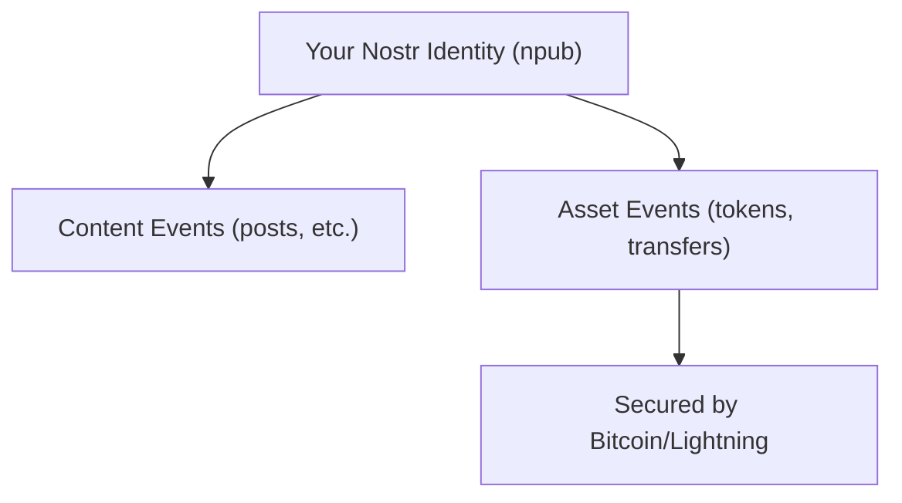
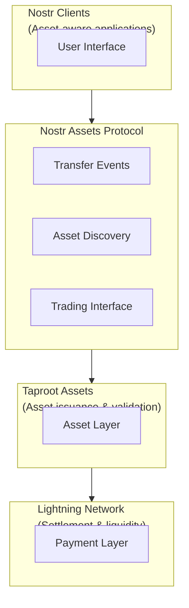

# Nostr Assets Protocol

Nostr Assets Protocol (now rebranded as Lnfi Network) brings Taproot Assets and native Bitcoin payments into the Nostr ecosystem, using your Nostr account as a wallet.

## Overview

Nostr Assets Protocol:
- Wraps Taproot Assets for Nostr
- Uses npub as wallet address
- Enables social asset discovery
- Supports Lightning transfers



## Key Features

### Npub as Wallet

Your Nostr public key becomes your asset wallet:

```
npub1abc... → Can hold Taproot Assets
           → Can receive transfers
           → Can send to other npubs
```

No separate wallet address needed.

### Chat-to-Trade

Natural language interaction:
- Request assets via DM
- Trade through conversation
- No complex interfaces

### Gas-Free Transactions

Since Nostr is off-chain:
- No blockchain fees for messages
- Only Lightning fees for settlement
- Faster user experience

## Architecture



## How It Works

### Asset Issuance

1. Creator defines asset parameters
2. Committed via Taproot Assets
3. Announced on Nostr
4. Discoverable by followers

### Transfers

```
Alice (npub1...) wants to send 100 tokens to Bob (npub2...)

1. Alice creates transfer request
2. Protocol routes via Lightning
3. Bob receives to his npub
4. Both wallets update
```

### Trading

Peer-to-peer trading via Nostr:

1. Alice posts: "Selling 1000 $TOKEN for 10,000 sats"
2. Bob replies to accept
3. Atomic swap executes
4. Both receive their assets

## Supported Assets

### Current

- Taproot Assets (fungible tokens)
- Custom-issued tokens
- Test assets for development

### Planned

- NFTs
- Stablecoins
- Cross-chain bridged assets

## Integration

### For Wallet Developers

```javascript
// Conceptual example
import { NostrAssetsWallet } from 'nostr-assets-sdk';

const wallet = new NostrAssetsWallet({
  nostrPubkey: userNpub,
  lightningNode: lndConnection
});

// Check balance
const balance = await wallet.getBalance('ASSET_ID');

// Send assets
await wallet.send({
  recipient: recipientNpub,
  assetId: 'ASSET_ID',
  amount: 100
});
```

### For Users

1. Use compatible wallet/client
2. Connect Lightning (for settlement)
3. Receive assets to your npub
4. Trade via Nostr interface

## Lnfi Network

The protocol has rebranded to **Lnfi Network** with expanded scope:

### LightningFi Vision

- Full financialization layer
- Staking and locking
- Fundraising tools
- Advanced trading

### Components

| Component | Purpose |
|-----------|---------|
| Lnfi Assets | Taproot Asset management |
| Lnfi Trade | Decentralized exchange |
| Lnfi Stake | Token staking |
| Lnfi Fund | Crowdfunding |

## Current Status

### What's Live

- Basic asset transfers
- Taproot Assets testnet
- Nostr integration

### In Development

- Mainnet production
- Advanced trading
- Mobile apps
- More asset types

## Considerations

### Trust Model

- Assets backed by Taproot Assets
- Lightning for settlement
- Nostr for communication only

### Risks

- Protocol is new/evolving
- Ecosystem still maturing
- Regulatory considerations

### Best Practices

- Start with small amounts
- Use testnet first
- Understand asset fundamentals
- Keep keys secure

## Resources

- [Lnfi Network Docs](https://doc.nostrassets.com)
- [Taproot Assets](/assets/taproot-assets)
- [Lightning Network](/payments/lightning-network)

---

:::warning Early Stage
Nostr Assets Protocol / Lnfi Network is in active development. Features and APIs may change. Use appropriate caution.
:::
