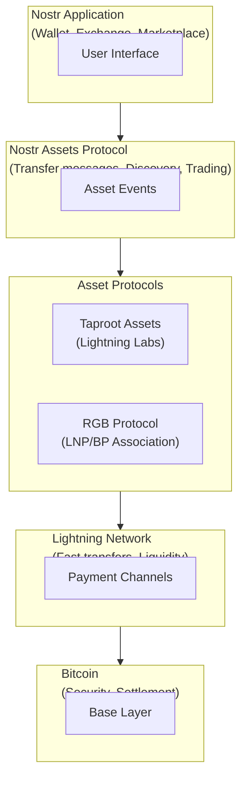
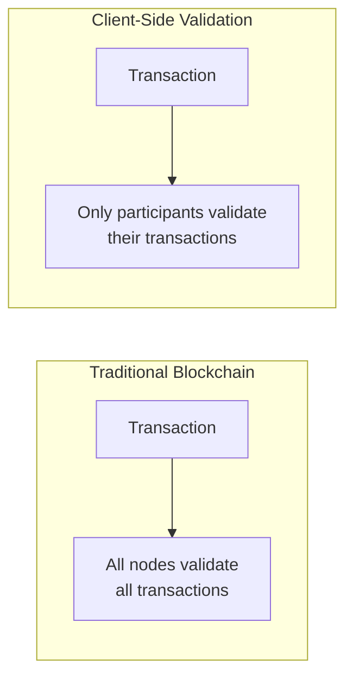

# Assets & Tokens on Nostr

Nostr is becoming a platform for issuing, managing, and trading digital assets built on Bitcoin. This section covers the protocols enabling tokenization in the Nostr ecosystem.

## Asset Technologies

| Technology | Description | Status |
|------------|-------------|--------|
| [Nostr Assets](/assets/nostr-assets) | Taproot Assets via Nostr | Production |
| [Taproot Assets](/assets/taproot-assets) | Lightning Labs protocol | Production |
| [RGB Protocol](/assets/rgb-protocol) | Client-side validation | Development |

## Why Assets on Nostr?

### Natural Fit

Nostr provides:
- **Identity** - Public keys for ownership
- **Communication** - Asset transfer messages
- **Discovery** - Find and browse assets
- **No new consensus** - Uses Bitcoin security

### Benefits

| Benefit | Description |
|---------|-------------|
| **No new chain** | Assets secured by Bitcoin |
| **Existing keys** | Your npub holds assets |
| **Social layer** | Discovery via follows |
| **Interoperability** | Multiple protocols supported |

## Asset Types

### Fungible Tokens

Interchangeable tokens like:
- Stablecoins (USD-backed)
- Community tokens
- Loyalty points
- Wrapped assets

### Non-Fungible Tokens (NFTs)

Unique assets like:
- Digital art
- Collectibles
- Tickets/access passes
- Proof of ownership

### Security Tokens

Regulated assets representing:
- Equity
- Debt instruments
- Real estate shares

## Architecture Overview

## Key Concepts

### Client-Side Validation

Both Taproot Assets and RGB use client-side validation:

Benefits:
- **Privacy** - Others don't see your transactions
- **Scalability** - No global validation
- **Efficiency** - Only relevant data

### Asset Issuance

Creating new assets:

1. **Define parameters** - Supply, divisibility, metadata
2. **Commit to Bitcoin** - Anchor in transaction
3. **Distribute** - Transfer to recipients
4. **Trade** - Via Lightning or Nostr

### Transfer Methods

| Method | Description |
|--------|-------------|
| **Lightning** | Instant, uses channels |
| **On-chain** | Slower, higher security |
| **Nostr** | Social discovery + Lightning |

## Current State

### What Works

- Asset issuance (Taproot Assets)
- Lightning transfers
- Basic Nostr integration
- Explorer/discovery tools

### In Development

- Full RGB integration
- Advanced trading features
- Cross-protocol swaps
- Regulated asset support

### Challenges

- Complexity for users
- Liquidity fragmentation
- Regulatory uncertainty
- Tooling maturity

## Getting Started

### For Users

1. **Learn basics** - Understand how assets work
2. **Get compatible wallet** - Zeus, specialized apps
3. **Start small** - Experiment with test assets
4. **Stay informed** - Follow development

### For Developers

1. **Study protocols** - Taproot Assets, RGB specs
2. **Use existing tools** - Don't reinvent
3. **Test thoroughly** - Handle edge cases
4. **Consider UX** - Abstract complexity

## Use Cases

### Stablecoins

- USD/EUR-backed tokens on Bitcoin
- Lightning fast transfers
- Nostr for discovery/trading

### Community Tokens

- Creator-issued tokens
- Loyalty/reward programs
- Governance participation

### Tokenized Assets

- Real-world asset representation
- Fractional ownership
- Programmable transfers

### Collectibles

- Digital art on Bitcoin
- Verifiable scarcity
- Social provenance

## See Also

- [Nostr Assets Protocol](/assets/nostr-assets)
- [Taproot Assets](/assets/taproot-assets)
- [RGB Protocol](/assets/rgb-protocol)

---

:::info Emerging Space
Asset tokenization on Nostr is an emerging area with rapid development. Expect changes as protocols mature and best practices emerge.
:::
