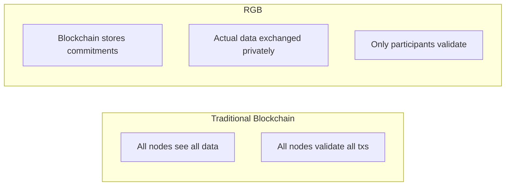
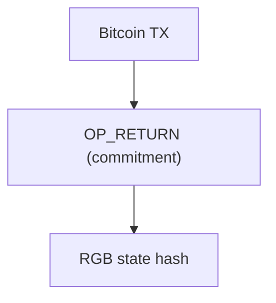
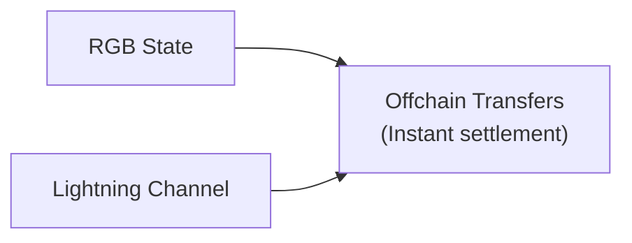

# RGB Protocol

RGB is a smart contract system for Bitcoin that enables asset issuance and complex programmable transactions using client-side validation.

## Overview

RGB provides:
- **Smart contracts** on Bitcoin
- **Asset issuance** with programmable rules
- **Client-side validation** for privacy/scalability
- **Lightning compatibility** for fast transfers

```
RGB = Bitcoin Security + Smart Contract Flexibility + Privacy
```

## Architecture

### Client-Side Validation Model



### Components

| Component | Purpose |
|-----------|---------|
| **Schema** | Asset/contract definition |
| **Genesis** | Initial state creation |
| **State Transition** | State changes |
| **Consignment** | Proof package |

## How RGB Works

### 1. Schema Definition

Defines what the asset/contract can do:

```
Schema: RGB20 (Fungible Token)
- max_supply: uint64
- can_burn: bool
- decimal_places: uint8
```

### 2. Genesis

Creates the initial state:

```
Genesis:
  schema: RGB20
  ticker: "MYTOKEN"
  name: "My Token"
  supply: 1000000
  owner: seal_definition
```

### 3. State Transitions

Changes ownership or state:

```
State Transition:
  input: previous_state
  output: new_state
  witness: signature
```

### 4. Anchoring

Commits to Bitcoin:



## RGB vs Taproot Assets

| Feature | RGB | Taproot Assets |
|---------|-----|----------------|
| Smart Contracts | Full | Limited |
| Complexity | Higher | Moderate |
| Maturity | Earlier stage | Production |
| Focus | Programmability | Lightning integration |
| Schema System | Flexible | Fixed types |

## Asset Types

### RGB20 - Fungible Tokens

Standard token interface:
- Fixed or unlimited supply
- Decimal precision
- Burn capability
- Metadata

### RGB21 - NFTs

Non-fungible assets:
- Unique identifiers
- Rich metadata
- Provenance tracking
- Attachments

### RGB25 - Collectibles

Limited series:
- Fractionalization
- Series management
- Rarity tiers

## Contract Capabilities

### What RGB Can Do

```
✓ Conditional transfers
✓ Multi-signature requirements
✓ Time-locked releases
✓ Burn mechanisms
✓ Issuance schedules
✓ Compliance rules
```

### Example: Vesting Contract

```
Vesting Schedule:
- 25% released immediately
- 25% after 6 months
- 25% after 12 months
- 25% after 18 months
```

## Lightning Integration

RGB can work with Lightning Network:



### Current Status

- Basic integration available
- Full integration in development
- Requires compatible nodes

## Development

### Libraries

- **rgb-core** - Rust core library
- **rgb-std** - Standard library
- **rgb-wallet** - Wallet implementation

### Example: Creating Asset

```rust
// Simplified conceptual example
use rgb::schema::RGB20;

let schema = RGB20::new();
let genesis = Genesis::new(
    schema,
    "MYTOKEN",
    "My Token",
    1_000_000u64,
    owner_seal
);

let contract = Contract::new(genesis);
```

## Ecosystem

### Wallets

- In development
- Research implementations
- Future integration expected

### Exchanges

- Bitfinex (investor/contributor)
- DEX research ongoing

### Tools

- RGB Explorer (development)
- CLI tools
- SDK libraries

## Nostr Integration

### Potential Uses

1. **Discovery** - Find RGB assets via Nostr
2. **Trading** - P2P exchanges using DMs
3. **Coordination** - Multi-party contracts
4. **Identity** - Nostr keys for RGB ownership

### Current State

- Conceptual integration
- Active research
- Community building

## Resources

- [RGB Website](https://rgb.tech)
- [LNP/BP Association](https://lnp-bp.org)
- [RGB Documentation](https://rgb.info)
- [GitHub](https://github.com/RGB-WG)

## Considerations

### Advantages

- Full smart contract capability
- Maximum privacy
- Bitcoin-native security
- No new consensus

### Challenges

- Complexity
- Tooling maturity
- Ecosystem development
- Learning curve

---

:::info Active Development
RGB is under active development with significant resources from organizations like Bitfinex and the Bitcoin community. Expect rapid evolution.
:::
