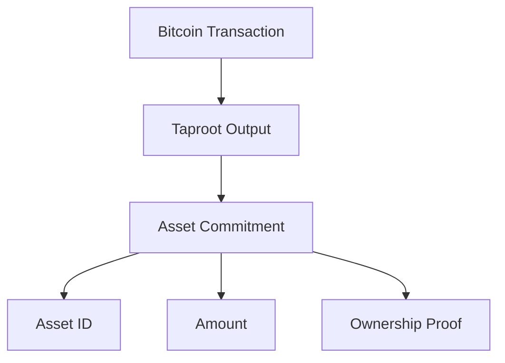
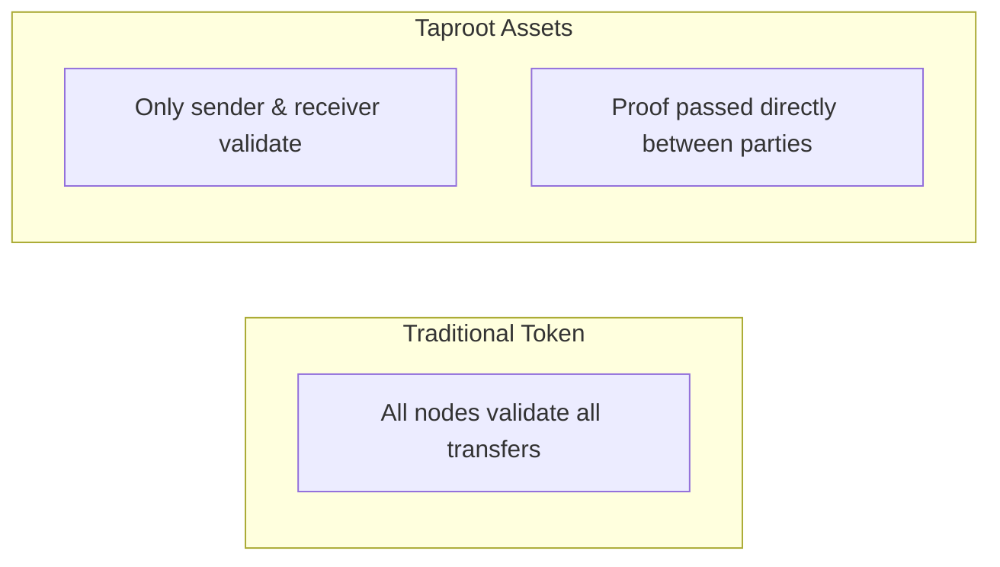
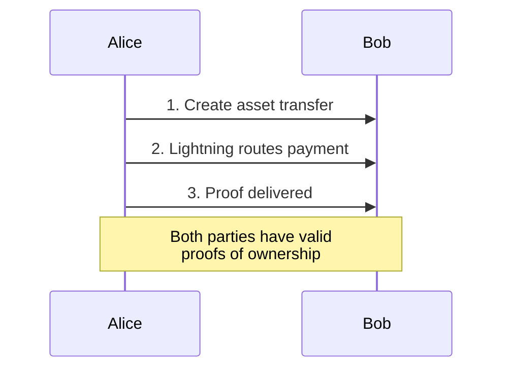
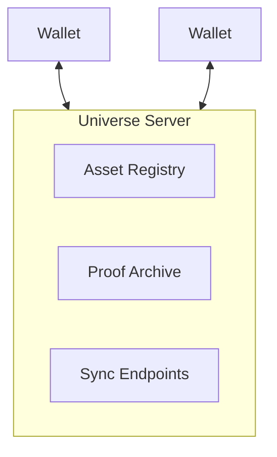

# Taproot Assets

Taproot Assets (formerly Taro) is a protocol developed by Lightning Labs for issuing assets on Bitcoin that can be transferred over the Lightning Network.

## Overview

Taproot Assets enables:
- **Asset issuance** on Bitcoin
- **Lightning transfers** for instant settlement
- **Client-side validation** for privacy
- **Atomic swaps** with BTC

```
Asset Issuance → Taproot Commitment → Lightning Transfers
```

## How It Works

### Taproot Integration

Assets are embedded in Taproot outputs:



The Bitcoin blockchain only sees a standard Taproot output.

### Client-Side Validation



Benefits:
- Privacy (others don't see your assets)
- Scalability (no global state)
- Efficiency (minimal blockchain usage)

## Asset Types

### Fungible Assets

Divisible tokens with total supply:

```
Asset: USD Stablecoin
Total Supply: 1,000,000 units
Divisibility: 8 decimals
```

### Non-Fungible Assets (NFTs)

Unique assets:

```
Asset: Digital Artwork
Supply: 1
Metadata: IPFS hash to image
```

### Collectibles

Limited editions:

```
Asset: Trading Card Series
Supply: 1000
Each card unique within series
```

## Issuance

### Creating an Asset

```bash
# Using tapcli
tapcli assets mint \
  --type normal \
  --name "MyToken" \
  --supply 1000000 \
  --meta "description:My custom token"
```

### Issuance Process

1. **Define asset** - Name, supply, type
2. **Generate commitment** - Cryptographic proof
3. **Anchor to Bitcoin** - Taproot transaction
4. **Finalize** - Asset becomes transferable

## Transfers

### On-Chain

Direct Taproot transaction:
- Higher security
- Bitcoin fees
- Slower confirmation

### Lightning

Via payment channels:
- Instant settlement
- Minimal fees
- Requires channel capacity

### Transfer Flow (Lightning)



## Universe Servers

Taproot Assets uses "Universe Servers" for:
- Asset discovery
- Proof distribution
- State synchronization



## Nostr Integration

### Discovery

Assets announced on Nostr:
- Issuers post about their assets
- Users discover through social graph
- Trading happens peer-to-peer

### Transfers

Using Nostr for coordination:
1. Parties find each other on Nostr
2. Negotiate trade via DMs
3. Execute via Lightning
4. Confirm via Nostr

## Comparison with RGB

| Aspect | Taproot Assets | RGB |
|--------|---------------|-----|
| Developer | Lightning Labs | LNP/BP Association |
| Focus | Lightning integration | General smart contracts |
| Maturity | Production ready | Development |
| Complexity | Moderate | Higher |
| Smart Contracts | Limited | Full support |

## Development

### Running a Node

```bash
# Requirements
- Bitcoin Core (Taproot enabled)
- LND (Lightning Labs daemon)
- tapd (Taproot Assets daemon)

# Start tapd
tapd --network=mainnet \
     --lnd.host=localhost:10009 \
     --bitcoin.host=localhost:8332
```

### Using tapcli

```bash
# List assets
tapcli assets list

# Mint new asset
tapcli assets mint --type normal --name "Token" --supply 1000000

# Send assets
tapcli assets send --addr tap1... --amount 100
```

## Ecosystem

### Wallets

- **Zeus** - Mobile with Taproot Assets
- **Lightning Terminal** - Desktop
- **Specialized apps** - In development

### Services

- **Exchanges** - Asset trading
- **Issuance platforms** - Easy asset creation
- **Universe providers** - Proof hosting

## Resources

- [Taproot Assets Docs](https://docs.lightning.engineering/the-lightning-network/taproot-assets)
- [GitHub Repository](https://github.com/lightninglabs/taproot-assets)
- [BIP-TAP Specification](https://github.com/lightninglabs/taproot-assets/tree/main/docs)

---

:::tip Lightning Native
Taproot Assets' primary advantage is native Lightning Network integration, enabling instant, low-cost asset transfers through existing Lightning infrastructure.
:::
