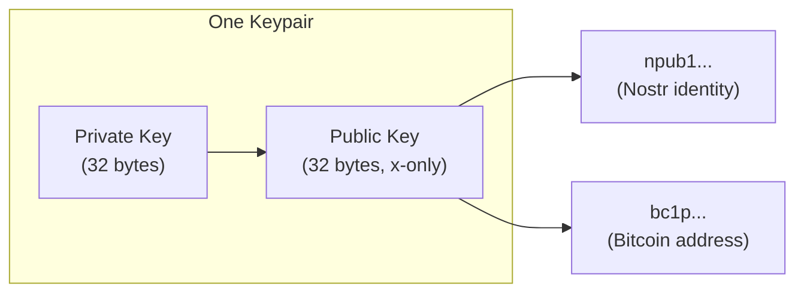

# Cryptography Overview

Nostr and Bitcoin share the same cryptographic foundation: **secp256k1 with Schnorr signatures**. This isn't coincidence - it's what makes Nostr "Taproot Native."

## The Shared Stack

| Layer | Specification | Used By |
|-------|--------------|---------|
| Curve | secp256k1 | Bitcoin, Nostr, Ethereum |
| Signatures | Schnorr (BIP-340) | Bitcoin Taproot, Nostr |
| Pubkey format | x-only (32 bytes) | Taproot, Nostr |
| Encoding | Bech32/Bech32m | bc1p..., npub1... |

**One keypair, two networks.** Your nsec signs Nostr events AND Bitcoin transactions. Your npub is your identity AND your P2TR address.

## Why secp256k1?

Bitcoin chose secp256k1 in 2009. Key properties:

- **Efficient**: Faster than NIST curves
- **No backdoor concerns**: Parameters are "nothing up my sleeve" numbers
- **Battle-tested**: Secures billions in value
- **Tooling**: Mature libraries everywhere

Nostr adopted it for Bitcoin compatibility, not because it's theoretically optimal.

## Why Schnorr?

Schnorr signatures (BIP-340) replaced ECDSA for Taproot:

| Property | ECDSA | Schnorr |
|----------|-------|---------|
| Signature size | 71-72 bytes | 64 bytes |
| Batch verification | No | Yes |
| Linearity | No | Yes (enables MuSig) |
| Complexity | Higher | Simpler |

**Linearity** is the key advantage: signatures can be aggregated, enabling:
- Multi-signatures that look like single-sig
- Adapter signatures for atomic swaps
- Threshold signatures

## The Taproot Native Insight

No bridges. No wrapping. No conversion. The same 32 bytes serve both purposes.

## What This Section Covers

| Topic | Why It Matters |
|-------|----------------|
| [X-Only Pubkeys](/cryptography/x-only-pubkeys) | The 1-byte tradeoff and lifting problem |
| [Schnorr Security](/cryptography/schnorr-security) | Nonce attacks, key safety |
| [Tweaks](/cryptography/tweaks) | Privacy via key derivation |
| [Silent Payments](/cryptography/silent-payments) | BIP-352 + Nostr notifications |

## Key Reuse: Feature, Not Bug

Some argue for separate derivation paths (m/44'/1237'/... for Nostr). We disagree.

**The whole point is unified identity.** Your npub IS your Bitcoin key. Separate paths fragment this:
- Two keys to backup
- Two identities to manage  
- Lost interoperability

If you need isolation, use testnet for testing. For mainnet, one key rules both.

## Security Foundations

The security of both Nostr and Bitcoin rests on:

1. **Discrete log hardness**: Can't derive private key from public key
2. **Hash function security**: SHA-256, used in signatures and tweaks
3. **Proper randomness**: Nonce generation is critical (see [Schnorr Security](/cryptography/schnorr-security))

Break any of these, break everything.

## See Also

- [X-Only Pubkeys](/cryptography/x-only-pubkeys) - The lifting problem
- [Schnorr Security](/cryptography/schnorr-security) - Nonce attacks
- [Tweaks](/cryptography/tweaks) - Key derivation for privacy
- [Taproot Wallets](/wallets/taproot) - Practical usage

---

:::info Same Keys, Same Security
Your Nostr security IS your Bitcoin security. Protect your nsec like it holds your life savings - because via P2TR, it can.
:::
