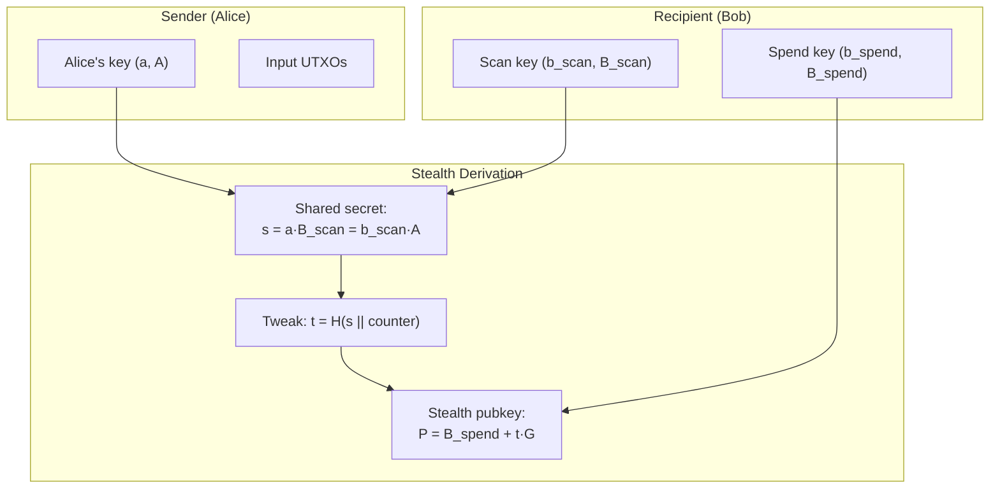
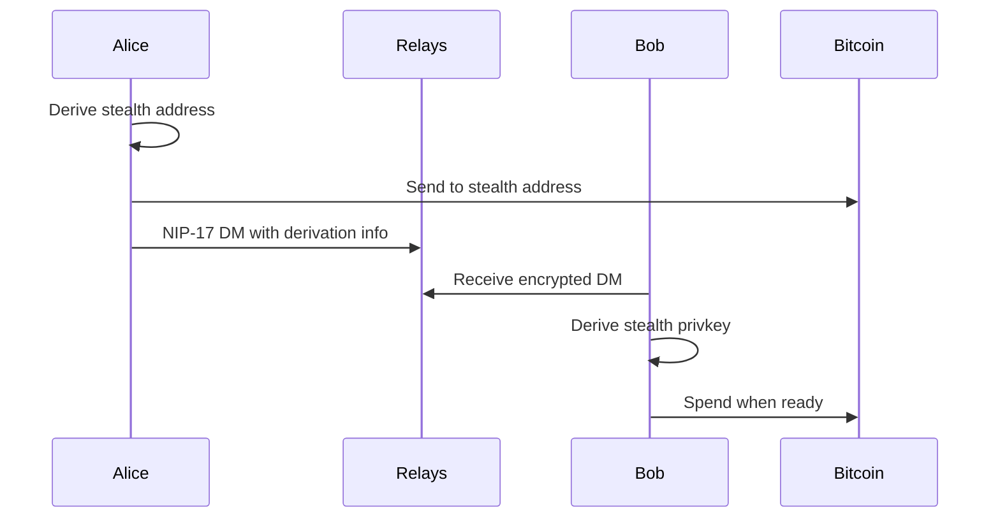

# Silent Payments

Silent Payments (BIP-352) generate a unique address for every payment, eliminating address reuse while preserving a single static identity. Combined with Nostr's encrypted messaging, they offer the best privacy for on-chain zaps.

## The Problem with Address Reuse

When you publish a static P2TR address derived from your npub:

```
npub1abc... → bc1pabc...
```

Every payment goes to the same address. Anyone can:
- See your total received
- Track your spending
- Correlate your activity

## How Silent Payments Work

Instead of a static address, each sender generates a **unique stealth address**:



### The Math

1. **Shared secret**: Alice computes `s = a·B_scan` using her private key and Bob's scan pubkey
2. **Tweak**: `t = SHA256(s || input_hash || counter)`
3. **Stealth address**: `P = B_spend + t·G`

Bob can compute the same tweak using `b_scan·A` and find the output.

### Key Properties

| Property | Benefit |
|----------|---------|
| Unique per sender | No address reuse |
| No interaction | Sender doesn't need recipient online |
| Single pubkey | Bob publishes one identity, receives many addresses |
| Deterministic | Same inputs = same address (idempotent) |

## Nostr as Notification Layer

The original BIP-352 requires recipients to scan the blockchain for outputs. With Nostr, we can do better.

### Without Notifications (Pure BIP-352)

```
Bob must:
1. Get all taproot transactions
2. Extract sender pubkeys from inputs
3. Try ECDH with each
4. Check if any output matches
```

This is CPU-intensive and requires a full node or scanning service.

### With NIP-17 Notifications



### Notification Format

```javascript
// Alice sends to Bob via NIP-17 (kind 14, sealed + gift-wrapped)
const notification = {
  kind: 14,
  content: JSON.stringify({
    type: 'silent_payment',
    version: 1,
    txid: 'abc123...',
    vout: 0,
    sender_pubkey: alicePubkey,  // A, for Bob to compute shared secret
    input_hash: inputHash,       // Per BIP-352
    counter: 0,                  // Which output in multi-output tx
    amount: 100000               // Sats (optional, verifiable on-chain)
  }),
  tags: [['p', bobNpub]]
};

// Wrapped per NIP-17 for sender/recipient privacy
```

### Why Nostr Notifications Win

| Aspect | Blockchain Scanning | Nostr Notifications |
|--------|--------------------|--------------------|
| CPU cost | High (scan all txs) | Low (just decrypt) |
| Latency | Must wait for indexer | Instant on publish |
| Infrastructure | Full node or service | Just relays |
| Privacy | Indexer sees your queries | Encrypted DMs |

## Implementation

### Generating a Silent Payment Address

```javascript
import { sha256 } from '@noble/hashes/sha256';
import { secp256k1 } from '@noble/curves/secp256k1';

function generateSilentPayment(senderPrivkey, recipientScanPub, recipientSpendPub, inputHash, counter = 0) {
  // 1. Compute shared secret
  const senderPub = secp256k1.getPublicKey(senderPrivkey);
  const sharedPoint = secp256k1.ProjectivePoint.fromHex(recipientScanPub)
    .multiply(BigInt('0x' + senderPrivkey));
  
  // 2. Compute tweak
  const tweakInput = Buffer.concat([
    sharedPoint.toRawBytes(true),
    Buffer.from(inputHash, 'hex'),
    Buffer.from([counter])
  ]);
  const tweak = sha256(tweakInput);
  const tweakScalar = BigInt('0x' + Buffer.from(tweak).toString('hex'));
  
  // 3. Compute stealth pubkey
  const spendPoint = secp256k1.ProjectivePoint.fromHex(recipientSpendPub);
  const tweakPoint = secp256k1.ProjectivePoint.BASE.multiply(tweakScalar);
  const stealthPub = spendPoint.add(tweakPoint);
  
  return {
    address: deriveP2TR(stealthPub.toHex()),
    senderPubkey: Buffer.from(senderPub).toString('hex'),
    inputHash,
    counter
  };
}
```

### Receiving (with Notification)

```javascript
function deriveStealthPrivkey(scanPrivkey, spendPrivkey, notification) {
  const { sender_pubkey, input_hash, counter } = notification;
  
  // 1. Compute shared secret
  const sharedPoint = secp256k1.ProjectivePoint.fromHex(sender_pubkey)
    .multiply(BigInt('0x' + scanPrivkey));
  
  // 2. Compute tweak (same as sender)
  const tweakInput = Buffer.concat([
    sharedPoint.toRawBytes(true),
    Buffer.from(input_hash, 'hex'),
    Buffer.from([counter])
  ]);
  const tweak = sha256(tweakInput);
  const tweakScalar = BigInt('0x' + Buffer.from(tweak).toString('hex'));
  
  // 3. Derive spending key
  const spendScalar = BigInt('0x' + spendPrivkey);
  const stealthPrivkey = (spendScalar + tweakScalar) % secp256k1.CURVE.n;
  
  return stealthPrivkey.toString(16).padStart(64, '0');
}
```

## Nostr-Specific Considerations

### Single Key Simplification

Full BIP-352 uses separate scan and spend keys. For Nostr, we can simplify:

```
scan_key = nsec
spend_key = nsec
```

Since your npub is already public, using one key for both scanning and spending is acceptable for most users.

### Label Support

BIP-352 labels let recipients create multiple "addresses" from one identity:

```javascript
const label = sha256('donations');
const labeledSpendPub = B_spend + label·G;
// Donors send to this; recipient knows to check for 'donations' label
```

Useful for:
- Separating donation types
- Per-project addresses
- Tracking payment sources

### Relay Considerations

For payment notifications:
- Use recipient's preferred relays (kind 10002)
- Consider dedicated payment relays
- Encrypt content (NIP-17 does this)

## Privacy Analysis

### What's Hidden

| From | Hidden |
|------|--------|
| Blockchain observers | Recipient identity (addresses unlinkable) |
| Relay operators | Payment details (encrypted) |
| Other users | Sender-recipient relationship |

### What's Visible

| To | Visible |
|----|---------|
| Sender | Recipient's scan pubkey (from npub/profile) |
| Recipient | Sender pubkey (in notification) |
| Blockchain | Transaction amounts (unless confidential tx) |

### Comparison to Simple Tweaks

| Approach | Privacy | Complexity | Notification |
|----------|---------|------------|--------------|
| Raw npub | None | Trivial | None needed |
| Simple tweaks | Moderate | Low | Share tweak |
| **Silent Payments** | High | Moderate | Per-payment |

## Wallet Support

### Current Support

| Wallet | Silent Payments | Nostr Integration |
|--------|----------------|-------------------|
| Cake Wallet | Yes | No |
| Sparrow | Experimental | Plugin |
| Blue Wallet | Planned | No |

### Future: NWC Extension

Nostr Wallet Connect could support silent payments:

```javascript
{
  "method": "get_silent_payment_address",
  "params": {
    "scan_pubkey": "...",
    "spend_pubkey": "...",
    "labels": ["donations"]
  }
}
```

## Limitations

### Blockchain Dependency

Unlike Lightning, payments still require:
- Confirmation time (10-60 min)
- On-chain fees
- UTXO management

### Sender Requirements

Senders must:
- Control their input keys (can't send from exchange)
- Have a Nostr client for notifications (or recipient scans)

### Multi-Output Complexity

Sending to multiple silent payment recipients in one tx requires careful output ordering and counter management.

## See Also

- [BIP-352: Silent Payments](https://github.com/bitcoin/bips/blob/master/bip-0352.mediawiki)
- [NIP-17: Private DMs](https://github.com/nostr-protocol/nips/blob/master/17.md)
- [On-Chain Zaps](/payments/onchain-zaps) - Simpler approach
- [Key Tweaks](/cryptography/tweaks) - Foundation for stealth addresses
- [X-Only Pubkeys](/cryptography/x-only-pubkeys) - Parity considerations

---

:::tip Best of Both Worlds
Silent Payments give you Bitcoin's security and permanence with privacy approaching Lightning. Nostr's encrypted messaging replaces expensive blockchain scanning with instant notifications.
:::
