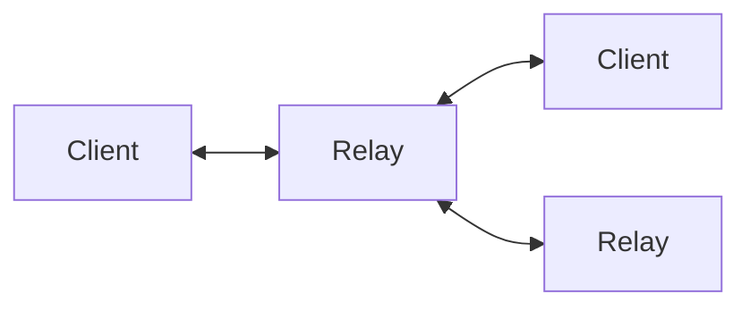
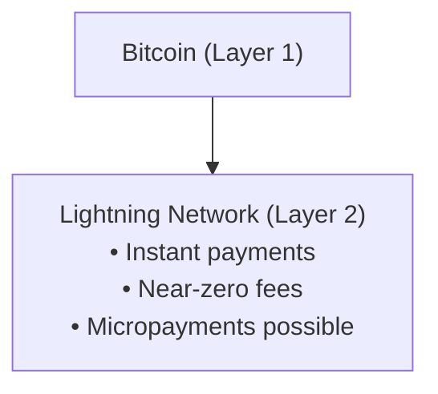
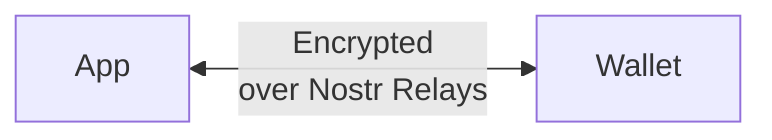
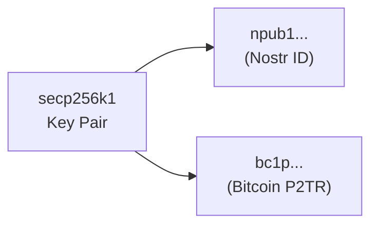

# Core Concepts

Understanding these fundamental concepts will help you navigate the Nostr finance ecosystem effectively.

## Identity

### Public Keys (npub)

Your Nostr identity is a cryptographic keypair:

```
Private Key (nsec): Used to sign events, KEEP SECRET
Public Key (npub):  Your public identity, share freely
```

Example:
```
npub1qny3tkh0acurzla8x3zy4nhrjz5zd8l9sy9jys09umwng00manysew95gx
```

### Why Keys Matter for Finance

- Your npub can receive payments
- Your nsec authorizes transactions
- Same key works for identity AND money

## Events

Everything on Nostr is an **event** - a signed JSON object:

```json
{
  "id": "event_hash",
  "pubkey": "your_npub_hex",
  "created_at": 1234567890,
  "kind": 1,
  "tags": [],
  "content": "Hello, Nostr!",
  "sig": "signature"
}
```

### Finance-Related Event Kinds

| Kind | Name | Purpose |
|------|------|---------|
| 9734 | Zap Request | Request a Lightning payment |
| 9735 | Zap Receipt | Proof of Lightning payment |
| 9041 | Zap Goal | Crowdfunding target |
| 23194 | NWC Request | Wallet connection request |
| 23195 | NWC Response | Wallet connection response |
| 30078 | App Data | Application-specific data |

## NIPs (Nostr Implementation Possibilities)

NIPs define how Nostr works. Finance-related NIPs include:

### Core Payment NIPs

- **NIP-47**: Nostr Wallet Connect
- **NIP-57**: Lightning Zaps
- **NIP-75**: Zap Goals

### How NIPs Work

```
Proposal → Discussion → Implementation → Adoption
```

NIPs ensure interoperability between different clients and services.

## Relays

Relays are servers that store and forward Nostr events:



### Relay Economics

For finance applications:
- **Free relays**: Basic functionality, may be unreliable
- **Paid relays**: Better uptime, spam filtering
- **Private relays**: For sensitive financial data

## Satoshis (sats)

The smallest unit of Bitcoin:

```
1 Bitcoin = 100,000,000 satoshis
1 satoshi ≈ $0.001 (at ~$100,000/BTC)
```

Common zap amounts:
- 21 sats - Symbolic (21 million BTC limit)
- 100 sats - Small tip (~$0.10)
- 1,000 sats - Solid appreciation (~$1)
- 10,000 sats - Significant (~$10)

## Lightning Network

Layer 2 scaling solution for Bitcoin:



### Key Lightning Concepts

- **Channels**: Payment pathways between nodes
- **Invoices**: Payment requests with amount and destination
- **LNURL**: Simplified Lightning interactions

## Nostr Wallet Connect (NWC)

Protocol for connecting wallets to apps via Nostr:



### NWC Connection String

```
nostr+walletconnect://[wallet-pubkey]?
  relay=[relay-url]&
  secret=[connection-secret]
```

### NWC Commands

| Command | Purpose |
|---------|---------|
| `pay_invoice` | Pay a Lightning invoice |
| `make_invoice` | Create an invoice |
| `get_balance` | Check wallet balance |
| `get_info` | Get wallet info |

## Taproot Native

Nostr is **Taproot native** - both use secp256k1 cryptography:



### Key Properties

- **Same cryptography**: secp256k1 with x-only public keys
- **Unified identity**: Your npub IS a Bitcoin address
- **No bridges**: Direct key usage, no wrapping

## Value for Value (V4V)

Economic model native to Nostr:

```
Traditional Model:
Content → Ads/Subscriptions → Revenue

Value for Value Model:
Content → Voluntary payments → Revenue
```

### V4V Principles

1. **Content is free** - No paywalls required
2. **Pay what it's worth** - Voluntary contribution
3. **Direct to creator** - No middleman
4. **Instant settlement** - Via Lightning

## Decentralized Identity (DID)

[DID:Nostr](/identity/did-nostr) enables:

```
did:nostr:pubkey → Verifiable identity
                → W3C compatible
                → Portable credentials
```

## Summary Table

| Concept | What It Is | Why It Matters |
|---------|------------|----------------|
| npub/nsec | Cryptographic keypair | Your identity and wallet |
| Events | Signed JSON objects | All data on Nostr |
| NIPs | Protocol specifications | Interoperability |
| Relays | Message servers | Network infrastructure |
| Sats | Bitcoin units | Payment denomination |
| Lightning | L2 payments | Fast, cheap transactions |
| NWC | Wallet protocol | App-wallet connection |
| Taproot | Bitcoin P2TR | Native on-chain payments |
| V4V | Economic model | Monetization without ads |

---

:::info Keep Learning
These concepts interconnect. As you use Nostr finance applications, you'll see how they work together to create a complete decentralized financial system.
:::
