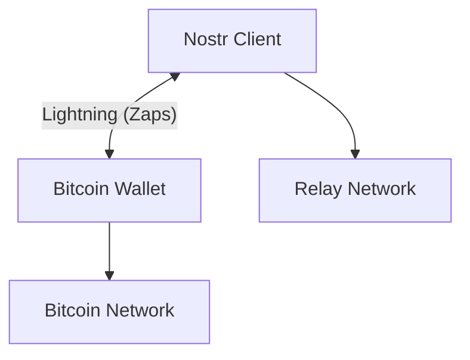
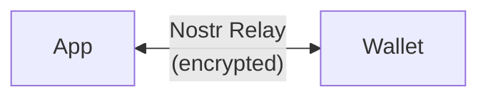
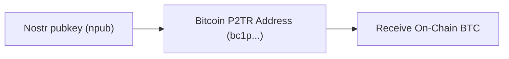
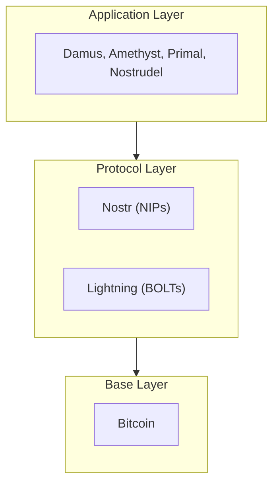

# Nostr & Bitcoin Relationship

Nostr and Bitcoin are two separate protocols that complement each other remarkably well. While Bitcoin provides decentralized money, Nostr provides decentralized communication—together they enable a complete decentralized financial ecosystem.

## Shared Foundations

### Same Cryptography

Both protocols use the **secp256k1** elliptic curve:

```
Nostr public key (hex): 32-byte hex string
Nostr public key (npub): npub1... (Bech32 encoded)
Bitcoin public key: Same 32-byte key
```

This shared cryptography means:
- One keypair can serve both protocols
- Nostr identities can directly receive Bitcoin
- Signatures are cross-verifiable

### Decentralization Philosophy

| Aspect | Bitcoin | Nostr |
|--------|---------|-------|
| Purpose | Store/transfer value | Store/transfer data |
| Network | Nodes validate transactions | Relays store/forward events |
| Identity | Addresses (derived from pubkeys) | Pubkeys (npub) |
| Censorship | Miners include transactions | Relays accept events |

## How They Work Together

### 1. Lightning Network Integration

The Lightning Network bridges Bitcoin and Nostr for instant payments:



When you "zap" someone on Nostr:
1. Your client creates a zap request (Nostr event)
2. The recipient's LNURL service receives it
3. Lightning payment is executed
4. A zap receipt (kind 9735) is published

### 2. Identity Unification

Your Nostr identity becomes your payment identity:

```javascript
// Nostr public key
const npub = "npub1abc123...";

// Same key can receive Lightning payments
const lightningAddress = "user@getalby.com";

// Or derive a Bitcoin address
const btcAddress = deriveBitcoinAddress(npub);
```

### 3. Proof of Payment

Nostr can provide cryptographic proof of Bitcoin payments:
- Zap receipts are signed events
- Payment proofs are verifiable by anyone
- Creates an auditable payment history

## Key Integration Points

### Nostr Wallet Connect (NWC)

NWC uses Nostr relays to communicate between apps and wallets:



Benefits:
- No direct network connection needed
- Works across firewalls and NATs
- Wallet can be on a separate device

### Taproot Native Payments

Your Nostr key can receive Bitcoin directly via Taproot:



## What Nostr is NOT

It's important to understand Nostr's role:

:::warning Nostr is Not a Blockchain
Nostr does not have:
- A native token
- Consensus mechanism
- Immutable ledger
- Smart contracts

Nostr is a **communication protocol** that works alongside Bitcoin.
:::

## The Complete Stack

A full Nostr + Bitcoin stack includes:



## Real-World Examples

### Social Tipping

1. Alice posts interesting content on Nostr
2. Bob reads it and decides to tip 1000 sats
3. Bob's client sends a Lightning payment
4. A zap receipt appears on Alice's post
5. Other users see the total zaps as a quality signal

### Marketplace Transaction

1. Seller lists product on Nostr marketplace
2. Buyer sends direct message to negotiate
3. Seller generates Lightning invoice
4. Buyer pays via their connected wallet
5. Both parties have cryptographic proof

### Crowdfunding

1. Creator publishes a Zap Goal event
2. Supporters zap the goal event
3. Progress is publicly visible
4. Funds go directly to creator's Lightning wallet

## Further Reading

- [Lightning Network Payments](/payments/lightning-network)
- [Nostr Wallet Connect](/wallets/nwc)
- [Zaps Deep Dive](/payments/zaps)

---

:::tip Key Takeaway
Think of Nostr as the "communication layer" and Bitcoin as the "value layer." Together, they enable trustless, decentralized financial interactions.
:::
