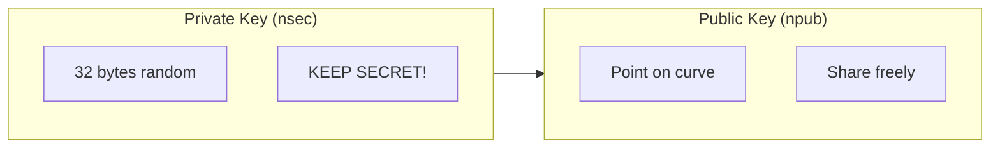
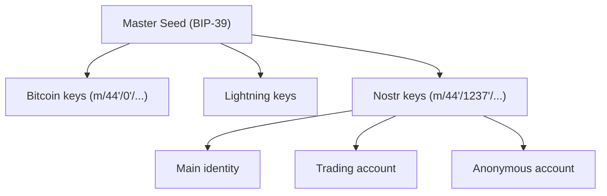
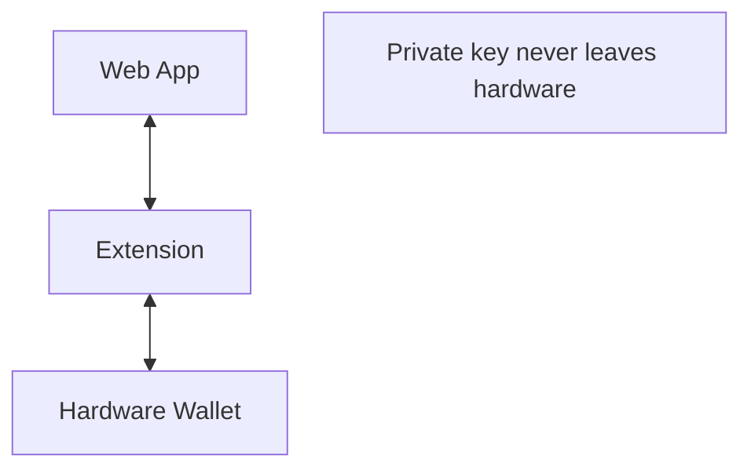

# Keys & Cryptography

Understanding Nostr's cryptographic foundations is essential for secure financial applications. This guide covers key management, security practices, and cryptographic operations.

## Key Fundamentals

### Keypair Structure

Nostr uses secp256k1 elliptic curve cryptography:



### Key Formats

| Format | Prefix | Use |
|--------|--------|-----|
| Hex | none | Internal processing |
| npub | `npub1` | Human-readable public key |
| nsec | `nsec1` | Human-readable private key |
| nprofile | `nprofile1` | Pubkey + relay hints |

### Example Keys

```
Private (nsec): nsec1vl029mgpspedva04g90vltkh6fvh240zqtv9k0t9af8935ke9laqsnlfe5

Public (npub):  npub10elfcs4fr0l0uf...

Hex pubkey:     7e7e9c42a91bfef19fa929e5d...
```

## Key Generation

### Secure Generation

```javascript
import { generatePrivateKey, getPublicKey } from 'nostr-tools';

// Generate cryptographically secure random key
const privateKey = generatePrivateKey();
const publicKey = getPublicKey(privateKey);
```

### From Seed Phrase (BIP-39)

```javascript
import { mnemonicToSeedSync } from 'bip39';
import { HDKey } from '@scure/bip32';

const mnemonic = "abandon abandon abandon...";
const seed = mnemonicToSeedSync(mnemonic);
const hdkey = HDKey.fromMasterSeed(seed);

// Nostr derivation path: m/44'/1237'/0'/0/0
const nostrKey = hdkey.derive("m/44'/1237'/0'/0/0");
const privateKey = nostrKey.privateKey;
```

## Key Security

### Storage Best Practices

```
DO:
✓ Store offline (paper, metal)
✓ Use hardware wallet when possible
✓ Encrypt digital backups
✓ Use multiple secure locations
✓ Test recovery process

DON'T:
✗ Store in plain text files
✗ Email or message keys
✗ Screenshot keys
✗ Store only in one place
✗ Use weak passwords for encryption
```

### Key Hierarchy for Finance



## Signing Operations

### Event Signing

```javascript
import { getEventHash, signEvent } from 'nostr-tools';

const event = {
  kind: 1,
  pubkey: publicKey,
  created_at: Math.floor(Date.now() / 1000),
  tags: [],
  content: "Hello Nostr!"
};

event.id = getEventHash(event);
event.sig = signEvent(event, privateKey);
```

### Signature Verification

```javascript
import { verifySignature } from 'nostr-tools';

const isValid = verifySignature(event);
// true if signature matches pubkey and content
```

### Financial Transaction Signing

For payments and transfers:

```javascript
// Zap request signing
const zapRequest = {
  kind: 9734,
  pubkey: myPubkey,
  content: "",
  tags: [
    ["p", recipientPubkey],
    ["amount", "1000000"],
    ["relays", "wss://relay.damus.io"]
  ],
  created_at: Math.floor(Date.now() / 1000)
};

zapRequest.id = getEventHash(zapRequest);
zapRequest.sig = signEvent(zapRequest, privateKey);
```

## NIP-07: Browser Extension Signing

Delegate signing to browser extensions:

```javascript
// Check for NIP-07 support
if (window.nostr) {
  // Get public key (no private key exposed)
  const pubkey = await window.nostr.getPublicKey();

  // Sign event (extension handles private key)
  const signedEvent = await window.nostr.signEvent(event);

  // Encrypt (NIP-04)
  const encrypted = await window.nostr.nip04.encrypt(
    recipientPubkey,
    "secret message"
  );
}
```

Benefits:
- Private key never exposed to web pages
- User approves each signing request
- Works across multiple sites

## Hardware Wallet Support

### Ledger Integration

Projects working on Nostr hardware wallet support:

**Ledger App (in development)**
- Key derivation
- Event signing
- NIP-07 bridge

### Security Model



## Key Rotation

### When to Rotate

- Key compromise suspected
- Regular security practice
- Transitioning to better security

### Rotation Process

1. **Generate new keypair**
2. **Announce transition** (signed by old key)
3. **Update profiles** with new key
4. **Migrate followers** (they need to re-follow)
5. **Move assets** to new key addresses

```json
{
  "kind": 1,
  "pubkey": "old_pubkey",
  "content": "I'm rotating to new key: npub1new...",
  "tags": [["p", "new_pubkey"]]
}
```

## Multi-Signature

### Conceptual (Not Standard Yet)

For high-value operations:

**Transaction requires (2-of-3 multisig):**
- Key A signature ✓
- Key B signature ✓
- Key C signature (optional)

### Current Workarounds

- Multiple single-key approvals
- Threshold signature schemes
- Social recovery patterns

## Encryption

### NIP-04: Encrypted DMs

```javascript
import { nip04 } from 'nostr-tools';

// Encrypt
const ciphertext = await nip04.encrypt(
  privateKey,
  recipientPubkey,
  "secret message"
);

// Decrypt
const plaintext = await nip04.decrypt(
  privateKey,
  senderPubkey,
  ciphertext
);
```

### NIP-44: Improved Encryption

Newer, more secure encryption:
- Better padding
- Versioned format
- Future-proof design

## Recovery

### Seed Phrase Backup

Your 12/24 word seed phrase:

| Word # | Example |
|--------|---------|
| 1 | abandon |
| 2 | ability |
| ... | ... |
| 12 | zone |

Store securely! This recovers everything.

### Social Recovery

Trusted contacts can help recover:
1. Split key into shares
2. Distribute to trusted contacts
3. Reconstruct with threshold of shares

## See Also

- [DID:Nostr](/identity/did-nostr)
- [Identity Verification](/identity/verification)
- [Wallets Overview](/wallets/overview)

---

:::danger Protect Your Keys
Your private key controls your identity AND any connected financial accounts. Treat it with the same care as your bank credentials—more, since there's no "forgot password" option.
:::
