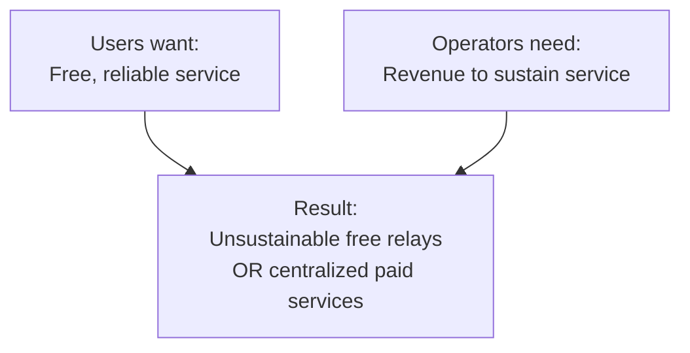
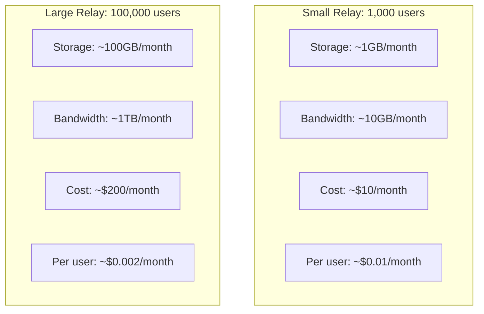

# Relay Economics

The economic sustainability of Nostr relays is crucial for the network's long-term health. This page explores the challenges and potential solutions for relay economics.

## Current State

### Challenges

- **95% of relays** struggle to cover operational costs
- **20% have experienced** significant downtime due to funding
- **Free relays** often shut down unexpectedly
- **Fragmentation** into specialized silos
- **Re-centralization** around a few large operators

### The Free Rider Problem



## Revenue Models

### 1. Paid Access

Charge for relay usage:

| Model | Example | Pros | Cons |
|-------|---------|------|------|
| One-time fee | 10,000 sats to write | Simple | May not cover long-term |
| Subscription | 1,000 sats/month | Predictable | Higher barrier |
| Per-event fee | 1 sat per event | Fair usage | Complex billing |

### 2. Freemium

Free basic, paid premium:
- Free: Read access, limited writes
- Paid: Full write access, better retention

### 3. Community Funding

Collective support:
- Donations from users
- Grants from organizations
- Corporate sponsorship

### 4. Value-Added Services

Premium features:
- Longer retention
- Faster delivery
- Advanced filtering
- API access

## Cost Analysis

### Typical Relay Costs

| Component | Monthly Cost |
|-----------|--------------|
| VPS (basic) | $5-20 |
| VPS (production) | $20-100 |
| Bandwidth | Variable |
| Storage | $0.10/GB |
| Maintenance | Time/labor |

### Scale Economics



## Sustainability Approaches

### Proof of Work

Require computational work to post:
- Spam deterrent
- Resource fairness
- No direct payment needed

```javascript
// NIP-13 style PoW
const difficulty = 20; // 20 leading zero bits
let nonce = 0;
while (!validPoW(event, nonce, difficulty)) {
  nonce++;
}
event.tags.push(['nonce', nonce.toString(), difficulty.toString()]);
```

### Reputation Systems

Prioritize trusted users:
- Followers/following weight
- Account age
- Previous behavior
- Web-of-trust metrics

### Micropayments

Pay per use via Lightning:

```javascript
// Hypothetical per-event payment
const invoice = await relay.getWriteInvoice(event);
await wallet.pay(invoice); // 1 sat
await relay.publish(event);
```

### Token-Based Access

Relay tokens or passes:
- Buy tokens in bulk
- Spend to write events
- Trade on market

## Economic Arguments

### For Paid Relays

**Advantages:**
- Sustainable business model
- Better service quality
- Spam reduction
- Clear incentive alignment

**Concerns:**
- Barrier to entry
- Excludes low-resource users
- May reduce decentralization

### For Free Relays

**Advantages:**
- Maximum accessibility
- Supports permissionless use
- Network effect growth

**Concerns:**
- Unsustainable long-term
- Quality issues
- Spam vulnerability

## Recommendations

### For Users

1. **Support paid relays** - Subscribe to at least one
2. **Donate** to free relays you use
3. **Run your own** if possible
4. **Diversify** relay connections

### For Operators

1. **Hybrid model** - Free tier + paid premium
2. **Community building** - Create value beyond hosting
3. **Specialization** - Focus on specific use cases
4. **Transparency** - Share costs and sustainability plans

### For Developers

1. **Respect relay resources** - Don't spam
2. **Implement retries** - Handle failures gracefully
3. **Support paid relays** - Integrate payment flows
4. **Optimize traffic** - Efficient queries

## Future Possibilities

### Lightning Integration

Direct micropayments for relay services:
- Pay per event
- Pay per subscription
- Pay for priority

### Relay Marketplace

Competition for services:
- Quality metrics
- Price comparison
- Automated selection

### Federated Models

Relay cooperatives:
- Shared costs
- Shared revenue
- Coordinated policies

### Protocol Incentives

Built-in economic layer:
- NIP for relay payments
- Standard pricing
- Quality commitments

## Current Initiatives

### OpenSats Relay Grants

Support for relay operators:
- Infrastructure funding
- Development grants
- Sustainability research

### Paid Relay Networks

Emerging networks:
- relay.tools ecosystem
- Specialized finance relays
- Community relay pools

## Resources

- [Nostr Watch](https://nostr.watch) - Relay monitoring
- [OpenSats](https://opensats.org) - Funding
- [Relay Software](https://github.com/aljazceru/awesome-nostr#relays)

---

:::warning Sustainability Matters
The long-term viability of Nostr depends on sustainable relay economics. Users benefiting from financial applications should consider supporting the infrastructure that makes them possible.
:::
