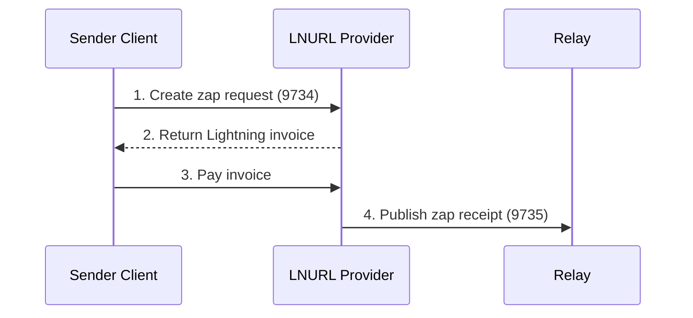

# NIP-57: Lightning Zaps

[NIP-57](https://github.com/nostr-protocol/nips/blob/master/57.md) defines how Lightning Network payments (zaps) work on Nostr, enabling users to tip content creators with Bitcoin.

## Summary

| Aspect | Detail |
|--------|--------|
| **Kinds** | 9734 (request), 9735 (receipt) |
| **Purpose** | Bitcoin tips via Lightning |
| **Status** | Merged |
| **Depends on** | NIP-01, LNURL |

## Overview

Zaps are Lightning payments tied to Nostr events:
- **9734**: Zap Request (initiates payment)
- **9735**: Zap Receipt (proves payment)

## Zap Request (kind 9734)

Created by the sender's client:

```json
{
  "kind": 9734,
  "pubkey": "sender_pubkey",
  "created_at": 1234567890,
  "content": "Great post! 🔥",
  "tags": [
    ["p", "recipient_pubkey"],
    ["e", "event_id_being_zapped"],
    ["amount", "1000000"],
    ["relays", "wss://relay1.com", "wss://relay2.com"],
    ["lnurl", "lnurl1..."]
  ]
}
```

### Required Tags

| Tag | Description |
|-----|-------------|
| `p` | Recipient's pubkey |
| `relays` | Where to publish receipt |

### Optional Tags

| Tag | Description |
|-----|-------------|
| `e` | Event being zapped |
| `a` | Parameterized replaceable event |
| `amount` | Amount in millisatoshis |
| `lnurl` | Recipient's LNURL |

### Content

Optional message from zapper to recipient.

## Zap Receipt (kind 9735)

Created by the LNURL provider after payment:

```json
{
  "kind": 9735,
  "pubkey": "lnurl_provider_pubkey",
  "created_at": 1234567890,
  "content": "",
  "tags": [
    ["p", "recipient_pubkey"],
    ["P", "sender_pubkey"],
    ["e", "zapped_event_id"],
    ["bolt11", "lnbc1000n1..."],
    ["description", "<stringified kind 9734 event>"],
    ["preimage", "payment_preimage"]
  ]
}
```

### Tags Explained

| Tag | Description |
|-----|-------------|
| `p` | Recipient (lowercase) |
| `P` | Sender (uppercase) |
| `e` | Zapped event |
| `bolt11` | Lightning invoice |
| `description` | Original zap request (stringified) |
| `preimage` | Payment proof |

## Flow



## LNURL Integration

### Recipient Setup

Profile (kind 0) must include `lud16` or `lud06`:

```json
{
  "name": "Alice",
  "lud16": "alice@getalby.com"
}
```

### LNURL Callback

The LNURL service must:
1. Accept the zap request in `nostr` query parameter
2. Validate the request
3. Generate Lightning invoice
4. Publish zap receipt after payment

### Callback URL

```
GET https://service.com/callback?
  amount=1000000&
  nostr=<url-encoded-kind-9734>&
  lnurl=<original-lnurl>
```

## Validation

### For Zap Receipts

Clients MUST verify:
1. Receipt signature is valid
2. `description` contains valid kind 9734
3. Zap request signature is valid
4. `p` tag matches request
5. `e` or `a` tag matches (if present)
6. `preimage` matches invoice (if present)

### Invalid Receipts

Discard receipts where:
- Signatures don't match
- Request was modified
- Tags don't align

## Anonymous Zaps

Sender can hide identity:
1. Generate ephemeral keypair
2. Sign request with ephemeral key
3. Don't include identifying info

Receipt will show ephemeral pubkey, hiding true sender.

## Private Zaps

For enhanced privacy (not fully standardized):
- Encrypt the zap request
- Only recipient can see sender
- Amount still visible

## Implementation

### Sending a Zap

```javascript
async function sendZap(recipientPubkey, eventId, amount, message) {
  // 1. Get recipient's LNURL
  const profile = await fetchProfile(recipientPubkey);
  const lnurl = profile.lud16 || profile.lud06;

  // 2. Create zap request
  const zapRequest = {
    kind: 9734,
    pubkey: myPubkey,
    created_at: Math.floor(Date.now() / 1000),
    content: message,
    tags: [
      ['p', recipientPubkey],
      ['e', eventId],
      ['amount', String(amount * 1000)],
      ['relays', 'wss://relay.damus.io'],
      ['lnurl', lnurl]
    ]
  };

  zapRequest.id = getEventHash(zapRequest);
  zapRequest.sig = signEvent(zapRequest, myPrivkey);

  // 3. Get invoice from LNURL
  const callbackUrl = await getLnurlCallback(lnurl);
  const response = await fetch(
    `${callbackUrl}?amount=${amount * 1000}&nostr=${encodeURIComponent(JSON.stringify(zapRequest))}`
  );
  const { pr: invoice } = await response.json();

  // 4. Pay invoice
  await wallet.payInvoice(invoice);
}
```

### Receiving Zaps

```javascript
async function countZaps(eventId) {
  const receipts = await fetchEvents({
    kinds: [9735],
    '#e': [eventId]
  });

  let total = 0;
  for (const receipt of receipts) {
    if (validateZapReceipt(receipt)) {
      const amount = extractAmount(receipt);
      total += amount;
    }
  }

  return total;
}
```

## Resources

- [NIP-57 Specification](https://github.com/nostr-protocol/nips/blob/master/57.md)
- [LNURL Specification](https://github.com/lnurl/luds)
- [Zaps Guide](/payments/zaps)

---

:::info Milestone
Zaps reached 1 million transactions in June 2023, demonstrating demand for social micropayments.
:::
