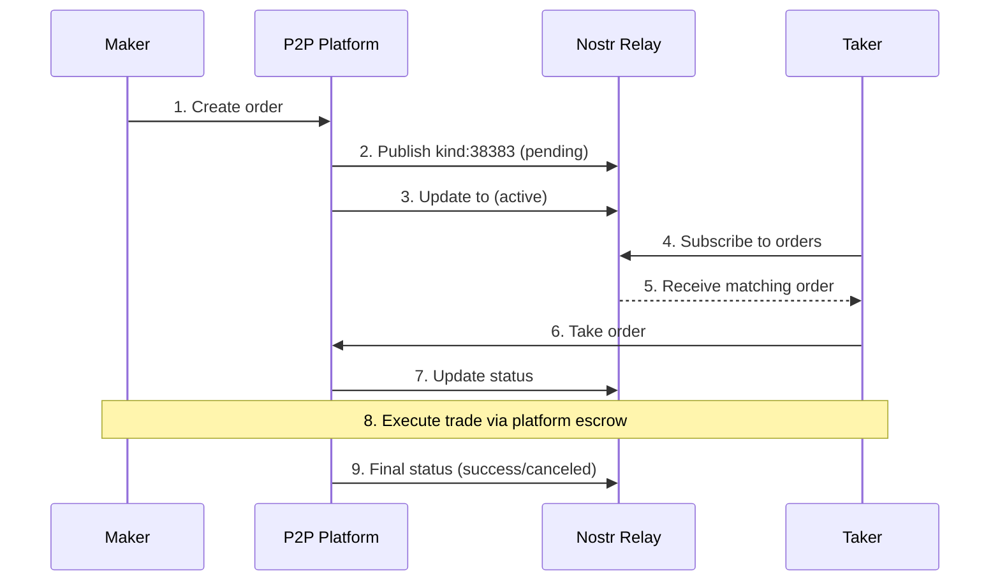
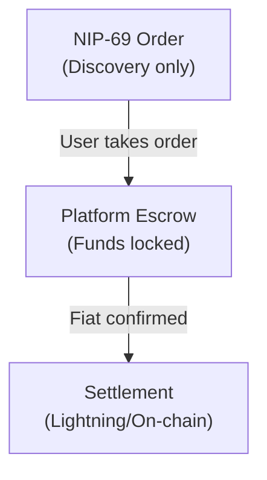

# NIP-69: Peer-to-Peer Order Events

[NIP-69](https://github.com/nostr-protocol/nips/blob/master/69.md) defines a standard format for peer-to-peer Bitcoin trading orders, enabling interoperability between P2P platforms.

## Summary

| Aspect | Detail |
|--------|--------|
| **Kind** | 38383 |
| **Purpose** | P2P trade order publication |
| **Status** | Merged |
| **Depends on** | NIP-01 |

## Overview

NIP-69 enables:
- **Interoperable orders** across P2P platforms
- **Aggregated order books** from multiple sources
- **Decentralized price discovery** for fiat/BTC
- **Platform-agnostic alerts** and notifications

## Order Event (kind 38383)

### Structure

```json
{
  "kind": 38383,
  "pubkey": "maker_pubkey",
  "created_at": 1704067200,
  "content": "",
  "tags": [
    ["d", "unique-order-id"],
    ["k", "sell"],
    ["f", "EUR"],
    ["s", "pending"],
    ["amt", "100000-500000"],
    ["fa", "100-500"],
    ["pm", "revolut", "sepa", "wise"],
    ["premium", "-2.5"],
    ["source", "https://mostro.network"],
    ["network", "lightning"],
    ["layer", "lightning"],
    ["name", "MostroP2P"],
    ["expiration", "1704153600"],
    ["bond", "2"]
  ]
}
```

## Tag Reference

### Required Tags

| Tag | Name | Description | Values |
|-----|------|-------------|--------|
| `d` | ID | Unique order identifier | String |
| `k` | Kind | Order type | `buy`, `sell` |
| `f` | Fiat | Fiat currency code | ISO 4217 (EUR, USD, etc.) |
| `s` | Status | Order status | See status values |

### Amount Tags

| Tag | Name | Description | Format |
|-----|------|-------------|--------|
| `amt` | Sats Amount | Bitcoin amount in sats | `min-max` or exact |
| `fa` | Fiat Amount | Fiat amount | `min-max` or exact |

**Examples:**
- `["amt", "100000-500000"]` - 100k to 500k sats
- `["amt", "250000"]` - Exactly 250k sats
- `["fa", "100-500"]` - 100 to 500 EUR
- `["fa", "0"]` - Any amount (market order)

### Pricing Tags

| Tag | Name | Description | Format |
|-----|------|-------------|--------|
| `premium` | Premium | Price premium/discount % | Decimal string |

**Examples:**
- `["premium", "5"]` - 5% above market
- `["premium", "-2.5"]` - 2.5% below market (discount)
- `["premium", "0"]` - Market price

### Payment Tags

| Tag | Name | Description | Values |
|-----|------|-------------|--------|
| `pm` | Payment Methods | Accepted payment methods | Multiple values |
| `network` | Network | Settlement network | `lightning`, `onchain` |
| `layer` | Layer | (Alias for network) | `lightning`, `onchain` |

**Common Payment Methods:**
```
revolut, sepa, wise, paypal, venmo, zelle, 
cashapp, strike, n26, pix, bizum, mbway
```

### Metadata Tags

| Tag | Name | Description |
|-----|------|-------------|
| `source` | Source | Platform URL |
| `name` | Name | Platform name |
| `bond` | Bond | Required bond percentage |
| `expiration` | Expiration | Unix timestamp |
| `y` | Platform Type | `mostro`, `robosats`, etc. |

## Status Values

| Status | Description |
|--------|-------------|
| `pending` | Order created, awaiting activation |
| `active` | Order is live and can be taken |
| `success` | Trade completed successfully |
| `canceled` | Order canceled by maker |
| `dispute` | Trade is in dispute |
| `expired` | Order expired |

## Event Flow



## Implementation Examples

### Publishing an Order

```javascript
const orderEvent = {
  kind: 38383,
  pubkey: makerPubkey,
  created_at: Math.floor(Date.now() / 1000),
  content: "", // Can be encrypted trade details
  tags: [
    ["d", crypto.randomUUID()],
    ["k", "sell"],
    ["f", "EUR"],
    ["s", "active"],
    ["amt", "100000-500000"],
    ["fa", "100-500"],
    ["pm", "revolut", "sepa"],
    ["premium", "-2"],
    ["network", "lightning"],
    ["source", "https://myplatform.com"],
    ["expiration", String(Math.floor(Date.now() / 1000) + 86400)]
  ]
};

orderEvent.id = getEventHash(orderEvent);
orderEvent.sig = signEvent(orderEvent, privateKey);

await pool.publish(relays, orderEvent);
```

### Subscribing to Orders

```javascript
// Subscribe to EUR sell orders
const filter = {
  kinds: [38383],
  "#f": ["EUR"],
  "#k": ["sell"],
  "#s": ["active"],
  since: Math.floor(Date.now() / 1000) - 86400
};

const sub = pool.subscribeMany(relays, [filter], {
  onevent(event) {
    const order = parseOrder(event);
    console.log(`${order.kind} ${order.amount} sats @ ${order.premium}%`);
  }
});
```

### Parsing Order Events

```javascript
function parseOrder(event) {
  const getTag = (name) => event.tags.find(t => t[0] === name)?.[1];
  const getTags = (name) => event.tags.find(t => t[0] === name)?.slice(1) || [];

  return {
    id: getTag('d'),
    kind: getTag('k'),          // 'buy' or 'sell'
    fiat: getTag('f'),          // 'EUR', 'USD', etc.
    status: getTag('s'),
    amount: parseRange(getTag('amt')),
    fiatAmount: parseRange(getTag('fa')),
    premium: parseFloat(getTag('premium') || '0'),
    paymentMethods: getTags('pm'),
    network: getTag('network') || getTag('layer'),
    source: getTag('source'),
    expiration: parseInt(getTag('expiration') || '0'),
    pubkey: event.pubkey
  };
}

function parseRange(str) {
  if (!str) return null;
  const parts = str.split('-');
  return parts.length === 2 
    ? { min: parseInt(parts[0]), max: parseInt(parts[1]) }
    : { exact: parseInt(parts[0]) };
}
```

### Filtering by Premium

```javascript
// Find orders with discount (negative premium)
function findDiscounts(orders) {
  return orders.filter(o => o.premium < 0)
    .sort((a, b) => a.premium - b.premium); // Best discounts first
}

// Find orders within premium range
function findInRange(orders, maxPremium) {
  return orders.filter(o => o.premium <= maxPremium);
}
```

## Relay Considerations

### Recommended Relays

P2P-focused relays that carry NIP-69 traffic:

```javascript
const p2pRelays = [
  'wss://relay.mostro.network',
  'wss://nostr.bilthon.dev',
  'wss://relay.damus.io',
  'wss://nos.lol'
];
```

### Event Retention

- Orders should include `expiration` tag
- Relays may garbage-collect expired orders
- Clients should filter by status and expiration

## Content Encryption

The `content` field can contain encrypted trade details:

```javascript
// Platform-specific encrypted content
{
  "content": "<NIP-04 encrypted JSON>",
  // ... tags
}

// Decrypted content might contain:
{
  "contact": "telegram:@trader123",
  "terms": "Payment within 15 minutes",
  "instructions": "Include order ID in payment reference"
}
```

## Platform Integration

### Mostro

- Native Nostr P2P exchange
- All orders published as kind:38383
- `["y", "mostro"]` tag identifies source

### Robosats

- Tor-based P2P exchange
- Publishes orders to Nostr
- `["source", "https://robosats.com"]`

### lnp2pbot

- Telegram bot for P2P trading
- Mirrors orders to Nostr
- `["name", "lnp2pbot"]`

## Security Considerations

### Order Authenticity

- Verify event signature matches pubkey
- Check that source platform is legitimate
- Don't trust content without platform verification

### Escrow

NIP-69 only defines order publication. Actual trades use platform escrow:



### Dispute Resolution

Handled by the originating platform, not the Nostr layer.

## See Also

- [P2P Trading Overview](/payments/p2p-trading)
- [NIP-69 GitHub](https://github.com/nostr-protocol/nips/blob/master/69.md)
- [Mostro Protocol](https://mostro.network/protocol)

---

:::tip Open Standard
NIP-69 creates network effects: the more platforms publish orders, the more valuable aggregators become, attracting more traders and platforms. It's a virtuous cycle toward unified P2P liquidity.
:::
