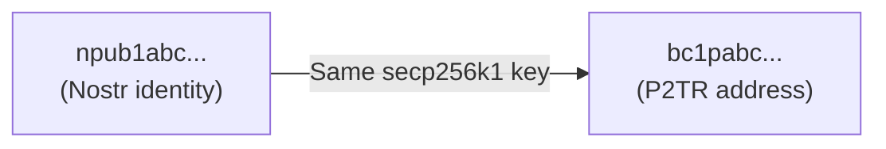
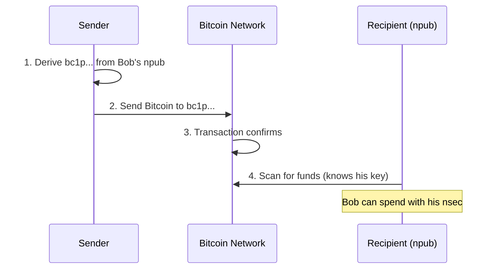
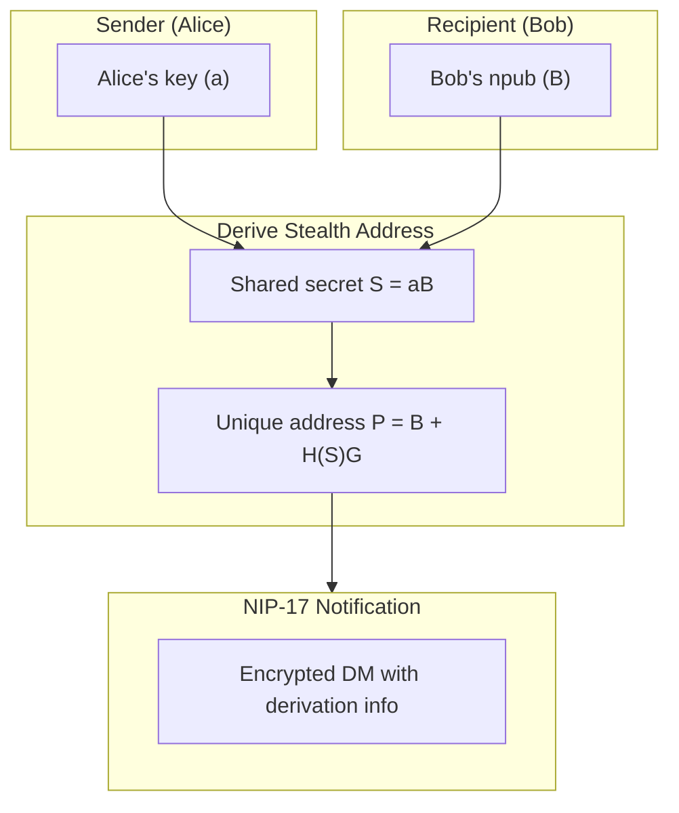
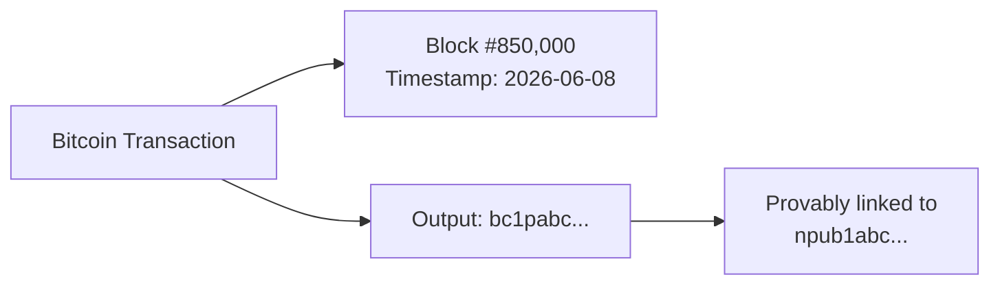

# On-Chain Zaps

On-chain zaps enable direct Bitcoin transfers to any Nostr user without Lightning Network intermediaries. By leveraging the shared cryptography between Nostr and Bitcoin Taproot, you can send Bitcoin to anyone's npub - whether they're ready to receive or not.

## Why On-Chain Zaps Matter

Lightning zaps (NIP-57) revolutionized Nostr payments, but they have friction:

| Challenge | Lightning Zaps | On-Chain Zaps |
|-----------|---------------|---------------|
| Recipient setup | Requires LNURL/LN address | None - npub is enough |
| Sender setup | Needs funded channels | Any Bitcoin wallet |
| Availability | Recipient must be online | Funds wait on-chain |
| Amount limits | Channel capacity | No upper limit |

**The key insight**: Your npub already IS a Bitcoin address. No setup required.

## How It Works

### The Cryptographic Bridge

Nostr and Bitcoin Taproot use identical cryptography:



Both are x-only public keys on secp256k1. The encoding differs, but the underlying key is the same.

### Deriving a P2TR Address

```javascript
import { nip19 } from 'nostr-tools';
import * as bitcoin from 'bitcoinjs-lib';

function npubToP2TR(npub) {
  // Decode npub to get raw pubkey
  const { data: pubkey } = nip19.decode(npub);
  
  // Create P2TR address (x-only pubkey, same as Nostr)
  const { address } = bitcoin.payments.p2tr({
    internalPubkey: Buffer.from(pubkey, 'hex'),
    network: bitcoin.networks.bitcoin
  });
  
  return address; // bc1p...
}

// Example
const npub = 'npub1sg6plzptd64u62a878hep2kev88swjh3tw00gjsfl8f237lmu63q0uf63m';
const btcAddress = npubToP2TR(npub);
// bc1p... derived directly from npub
```

### Simple On-Chain Zap Flow



## Client Support

### Ditto

[Ditto 2.12](https://soapbox.pub/blog/onchain-zaps-in-ditto) shipped on-chain zaps first:
- One-click on-chain tips
- Automatic address derivation
- Integrated with Soapbox UI

### Amethyst

Android's leading Nostr client added support within 24 hours:
- On-chain zap option alongside Lightning
- Wallet integration
- Transaction tracking

### More Coming

The simplicity of the approach means any client can add support:
1. Derive P2TR from recipient's npub
2. Generate a Bitcoin URI or QR
3. User pays with any Bitcoin wallet

## Privacy Considerations

:::warning Public Ledger
On-chain zaps create a permanent, public link between your npub and Bitcoin transactions. Consider the tradeoffs.
:::

### The Privacy Tradeoff

| Aspect | Implication |
|--------|-------------|
| **Address reuse** | All zaps to same npub go to same address |
| **Public history** | Anyone can see total received |
| **Sender correlation** | Your funding source is visible |
| **Dust attacks** | Anyone can send tiny amounts |

### Choosing Your Privacy Level

| Use Case | Recommended Approach |
|----------|---------------------|
| Public tips (attribution wanted) | Raw npub → P2TR |
| Moderate privacy | Tweaked keys |
| High privacy | Silent Payments + NIP-17 |
| Maximum privacy | Lightning zaps |

### When On-Chain Makes Sense

- Large tips where Lightning capacity is insufficient
- Recipients without Lightning setup
- Long-term savings/accumulation
- When you don't mind public attribution (or use tweaks)

### When to Use Lightning Instead

- Privacy-sensitive payments
- Frequent small tips
- When recipient has LNURL configured

## Simple Tweaks: A Privacy Middle Ground

Between raw npub derivation (fully public) and Silent Payments (complex), there's a practical middle ground: **tweaked keys**.

### The Problem with Raw Derivation

```
npub1abc... → bc1pabc...
```

Anyone can compute this mapping. Your npub becomes a transparent window into your Bitcoin holdings.

### Tweaked Key Approach

Instead of deriving P2TR directly from the raw npub, apply a tweak:

```javascript
import { sha256 } from '@noble/hashes/sha256';
import { secp256k1 } from '@noble/curves/secp256k1';

function tweakedP2TR(npubHex, tweakData = 'nostr-zap') {
  // Compute tweak: H(pubkey || domain)
  const tweak = sha256(
    Buffer.concat([
      Buffer.from(npubHex, 'hex'),
      Buffer.from(tweakData)
    ])
  );
  
  // Tweaked pubkey: P' = P + tweak*G
  const pubPoint = secp256k1.ProjectivePoint.fromHex(npubHex);
  const tweakPoint = secp256k1.ProjectivePoint.BASE.multiply(
    BigInt('0x' + Buffer.from(tweak).toString('hex'))
  );
  const tweakedPub = pubPoint.add(tweakPoint);
  
  // Derive P2TR from tweaked key
  return deriveP2TR(tweakedPub.toHex());
}
```

### Privacy Tradeoff Spectrum

| Approach | Privacy | Complexity | Recipient Setup |
|----------|---------|------------|-----------------|
| Raw npub → P2TR | None | Trivial | None |
| **Tweaked key** | Moderate | Low | Know the tweak |
| Silent Payments | High | Moderate | Wallet support |
| Fresh key per tx | Maximum | High | Per-tx coordination |

### How Tweaks Help

1. **Address unlinkability**: `bc1p-tweaked` can't be trivially mapped back to `npub1...`
2. **Still spendable**: Owner knows their nsec + tweak, can derive the spending key
3. **Deterministic**: Same sender + recipient + tweak = same address (good for recurring)
4. **No scanning**: Unlike Silent Payments, no blockchain scanning needed

### Sender-Specific Tweaks

For better privacy, use sender-specific tweaks:

```javascript
// Sender includes their pubkey in the tweak
const tweak = sha256(senderPubkey + recipientPubkey + 'zap');
// Now each sender→recipient pair has a unique address
```

The recipient can try known sender pubkeys to find payments, or senders notify via NIP-17 DM.

## Silent Payments: Privacy-Enhanced On-Chain

For maximum privacy, **Silent Payments** (BIP-352) combined with Nostr notifications solve address reuse:

### How Silent Payments Work



### Nostr as Notification Layer

Instead of on-chain notifications (OP_RETURN), use NIP-17 encrypted DMs:

```javascript
// Sender creates notification for recipient
const notification = {
  kind: 14, // NIP-17 chat message (sealed + gift-wrapped)
  content: JSON.stringify({
    type: 'silent_payment',
    sender_pubkey: alicePubkey,
    counter: i,
    txid: transactionId
  }),
  tags: [['p', bobPubkey]]
};

// Wrapped per NIP-17 for privacy
// Bob receives everything needed to find and spend the UTXO
```

**Benefits:**
- No address reuse (each payment gets unique address)
- No on-chain scanning required
- Private notification via encrypted DMs
- Works with existing Nostr infrastructure

## Integration with Wallets

### Sparrow Wallet

Sparrow has a "color-address" plugin demonstrating:
- Stealth address generation from npub
- NIP-17 notification broadcasting
- Automatic UTXO detection

### Future: NWC for On-Chain

Nostr Wallet Connect (NIP-47) could extend to on-chain:

```javascript
// Hypothetical NWC on-chain method
{
  "method": "pay_onchain",
  "params": {
    "address": "bc1p...",
    "amount": 100000,  // sats
    "fee_rate": 10     // sat/vB
  }
}
```

## Implementation Guide

### For Client Developers

1. **Add P2TR derivation** - Convert npub to bc1p address
2. **Generate payment URI** - `bitcoin:bc1p...?amount=0.001`
3. **Show QR code** - User scans with any Bitcoin wallet
4. **Optional: Track payments** - Monitor address for incoming txs

### For Wallet Developers

1. **Recognize npub inputs** - Auto-convert to P2TR
2. **Support Silent Payments** - BIP-352 + NIP-17 notifications
3. **Integrate NWC** - Remote signing for on-chain

### Example: Minimal On-Chain Zap Button

```typescript
import { nip19 } from 'nostr-tools';
import { payments, networks } from 'bitcoinjs-lib';

function OnChainZapButton({ recipientNpub, amountSats }) {
  const handleZap = () => {
    const { data: pubkey } = nip19.decode(recipientNpub);
    
    const { address } = payments.p2tr({
      internalPubkey: Buffer.from(pubkey, 'hex'),
      network: networks.bitcoin
    });
    
    const btcAmount = amountSats / 100_000_000;
    const uri = `bitcoin:${address}?amount=${btcAmount}`;
    
    window.open(uri); // Opens user's Bitcoin wallet
  };
  
  return <button onClick={handleZap}>Zap On-Chain</button>;
}
```

## Comparison: Lightning vs On-Chain Zaps

| Feature | Lightning (NIP-57) | On-Chain |
|---------|-------------------|----------|
| Speed | Instant | 10-60 min confirmation |
| Fees | ~1 sat | Variable (market rate) |
| Privacy | Route-based | Public ledger |
| Setup | LNURL required | None (npub = address) |
| Max amount | Channel limited | Unlimited |
| Offline receive | No | Yes |
| Proof | Zap receipt (kind 9735) | On-chain transaction |

## Testing on Testnet/Signet

On-chain zaps are perfect for testnet experimentation - same cryptography, zero risk.

### Why Use Testnet

| Benefit | Description |
|---------|-------------|
| **Free coins** | Faucets provide test sats |
| **Same code paths** | Identical derivation logic |
| **Safe iteration** | Mistakes cost nothing |
| **Client testing** | Verify UX before mainnet |

### Deriving Testnet Addresses

```javascript
import { payments, networks } from 'bitcoinjs-lib';

function npubToTestnetP2TR(npubHex) {
  const { address } = payments.p2tr({
    internalPubkey: Buffer.from(npubHex, 'hex'),
    network: networks.testnet  // or networks.regtest
  });
  return address; // tb1p... (testnet) or bcrt1p... (regtest)
}
```

### Testnet Faucets

- [coinfaucet.eu](https://coinfaucet.eu/en/btc-testnet/) - Testnet3
- [signetfaucet.com](https://signetfaucet.com/) - Signet
- [bitcoinfaucet.uo1.net](https://bitcoinfaucet.uo1.net/) - Testnet3

### Signet vs Testnet

| Network | Stability | Reorgs | Best For |
|---------|-----------|--------|----------|
| Testnet3 | Variable | Frequent | Quick tests |
| Signet | Stable | Rare | Realistic testing |
| Regtest | Local | Controlled | Development |

For on-chain zap development, **Signet** is recommended - stable block times, realistic fee market.

## Proof of Publication

An underappreciated property: on-chain zaps create **immutable, timestamped proof** that a payment was made to a specific Nostr identity.

### What You Get



The blockchain permanently records:
- **When**: Block timestamp (unforgeable)
- **How much**: Exact satoshi amount
- **To whom**: P2TR address → npub mapping is deterministic

### Use Cases for Proof of Publication

| Use Case | How It Helps |
|----------|--------------|
| **Provable donations** | "I donated X sats to @developer on date Y" |
| **Grant accountability** | Public record of fund distribution |
| **Patronage history** | Verifiable support timeline |
| **Contract payments** | Timestamped proof of payment |
| **Dispute resolution** | Immutable payment evidence |

### Verification

Anyone can verify a claimed on-chain zap:

```javascript
function verifyOnChainZap(txid, npub, expectedAmount) {
  // 1. Fetch transaction from any block explorer
  const tx = await fetchTransaction(txid);
  
  // 2. Derive expected address from npub
  const expectedAddress = npubToP2TR(npub);
  
  // 3. Check outputs
  const matchingOutput = tx.outputs.find(
    o => o.address === expectedAddress && o.value >= expectedAmount
  );
  
  return {
    verified: !!matchingOutput,
    blockHeight: tx.blockHeight,
    timestamp: tx.blockTime,
    amount: matchingOutput?.value
  };
}
```

### Contrast with Lightning

| Aspect | Lightning Zap | On-Chain Zap |
|--------|--------------|--------------|
| Public proof | Zap receipt (kind 9735) | Blockchain tx |
| Immutability | Relay-dependent | Bitcoin-secured |
| Timestamp | Event created_at | Block timestamp |
| Verifiable by | Nostr users | Anyone with internet |
| Permanence | Relay retention | Forever |

Lightning zap receipts are Nostr events - they can be lost if relays purge data. On-chain transactions are permanent.

### Combining Both

For important payments, do both:
1. **On-chain zap** → Permanent blockchain proof
2. **Nostr announcement** → Social visibility

```json
{
  "kind": 1,
  "content": "Just supported @developer with an on-chain zap! 🔗",
  "tags": [
    ["p", "developer_npub"],
    ["r", "https://mempool.space/tx/abc123..."]
  ]
}
```

## Best Practices

### For Senders

1. **Check for Lightning first** - If recipient has lud16, use Lightning
2. **Confirm large amounts** - On-chain is permanent
3. **Consider fees** - Batch if sending to multiple recipients
4. **Use Silent Payments** - When privacy matters

### For Recipients

1. **Monitor your address** - Funds may arrive unexpectedly
2. **Consider privacy** - Your on-chain history becomes public
3. **Set up Lightning too** - Offer both options
4. **Use separate keys** - Consider derived keys for large holdings

## See Also

- [Taproot Wallets](/wallets/taproot) - Understanding P2TR
- [Lightning Zaps](/payments/zaps) - NIP-57 Lightning payments
- [On-Chain Payments](/payments/onchain) - General on-chain guide
- [NIP-17](https://github.com/nostr-protocol/nips/blob/master/17.md) - Private DMs for notifications

---

:::tip The Simplest Path
On-chain zaps are the most direct expression of "Nostr is Taproot Native" - your identity IS your wallet. While Lightning remains best for most zaps, on-chain opens the door to anyone with Bitcoin, no setup required.
:::
