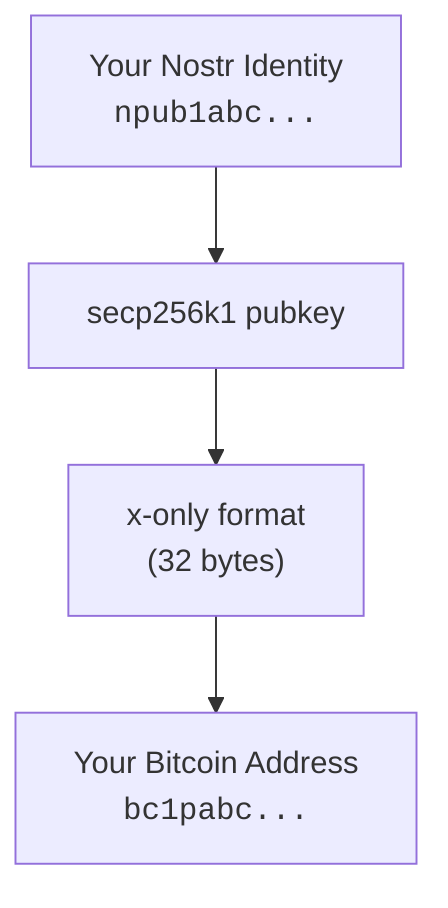
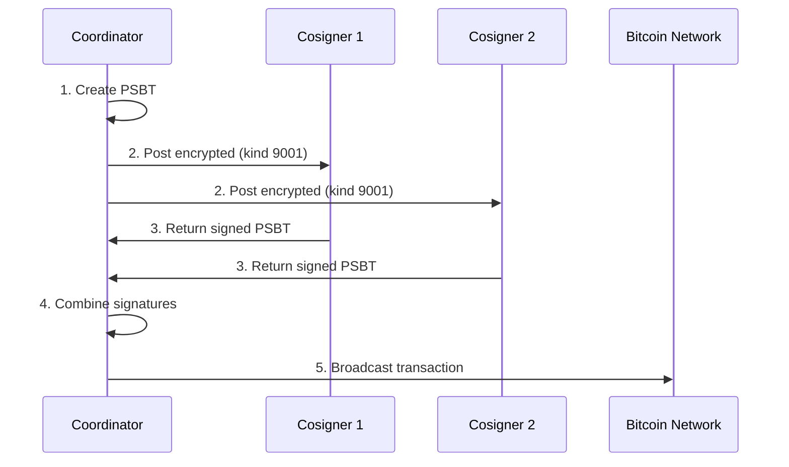
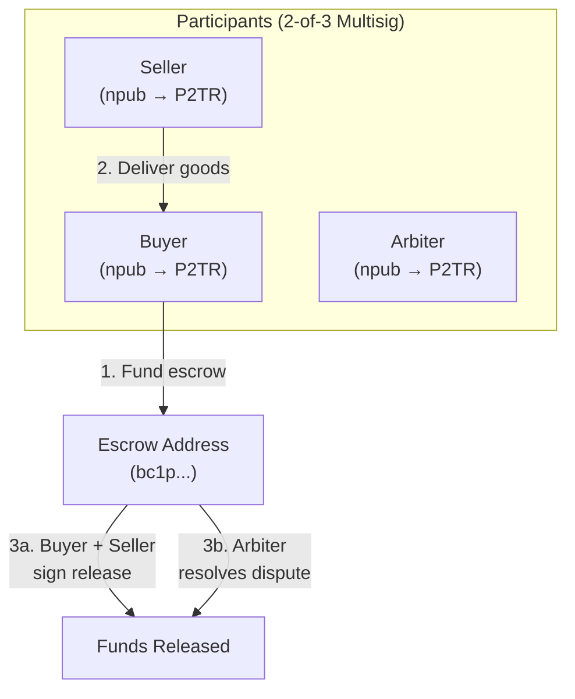

# On-Chain Payments

While Lightning enables instant micropayments, on-chain Bitcoin transactions remain essential for larger amounts and long-term storage. Nostr's Taproot-native design makes on-chain integration seamless.

## When to Use On-Chain

| Use Case | Recommended Method |
|----------|-------------------|
| Tips under $10 | Lightning (Zaps) |
| Payments $10-$1000 | Lightning |
| Large payments $1000+ | On-chain |
| Savings/HODL | On-chain (cold storage) |
| Smart contracts | On-chain (Taproot) |

## Nostr + Taproot: Native Integration

### The Key Insight

Nostr keys and Bitcoin Taproot keys are **cryptographically identical**:



This means:
- **No bridges** - Direct key usage
- **No wrapping** - Native Bitcoin
- **No intermediaries** - Pure P2P

### Deriving Your Bitcoin Address

From any Nostr public key:

```javascript
import { bech32m } from '@scure/base';

function npubToP2TR(npub) {
  // Decode npub to get raw pubkey
  const { words } = bech32.decode(npub);
  const pubkeyBytes = bech32.fromWords(words.slice(1));

  // Encode as P2TR address (witness version 1)
  const words5bit = bech32m.toWords(pubkeyBytes);
  return bech32m.encode('bc', [1, ...words5bit]);
}

// Example
const npub = 'npub1...';
const btcAddress = npubToP2TR(npub);
// Returns: bc1p...
```

## Payment Flows

### Simple Payment

```
1. Alice wants to pay Bob on-chain
2. Alice looks up Bob's profile (kind 0)
3. Bob's profile contains bitcoin address
4. Alice sends Bitcoin to bc1p... address
5. Optionally: Alice posts receipt on Nostr
```

### Payment with Verification

```
1. Bob creates payment request event
2. Alice sees request with amount + address
3. Alice pays and gets txid
4. Alice replies with txid as proof
5. Bob verifies on-chain
```

### Proposed Event Structure

```json
{
  "kind": 9000,
  "content": "Payment for consulting services",
  "tags": [
    ["amount", "100000", "sats"],
    ["address", "bc1p..."],
    ["network", "mainnet"],
    ["expires", "1735689600"]
  ]
}
```

## Profile Integration

### Adding Bitcoin Address

Include in your kind 0 metadata:

```json
{
  "kind": 0,
  "content": "{\"name\":\"Alice\",\"bitcoin\":\"bc1p...\",\"lud16\":\"alice@getalby.com\"}"
}
```

### Multiple Addresses

For privacy, rotate addresses:

```json
{
  "bitcoin": "bc1p...",
  "bitcoin_xpub": "xpub...",
  "bitcoin_derivation": "m/86'/0'/0'"
}
```

## Transaction Coordination

### PSBT via Nostr

Share Partially Signed Bitcoin Transactions:

```json
{
  "kind": 9001,
  "content": "<base64-encoded-psbt>",
  "tags": [
    ["p", "cosigner-pubkey"],
    ["purpose", "multisig-spend"],
    ["expires", "1735689600"]
  ]
}
```

### Multi-Signature Workflow



## Privacy Considerations

### Address Reuse

:::warning Avoid Address Reuse
Posting the same Bitcoin address repeatedly links all payments to your identity. Use fresh addresses when possible.
:::

### Solutions

1. **HD Wallets**: Derive new addresses from xpub
2. **Payment Codes** (BIP-47): Reusable payment codes
3. **Silent Payments**: Proposed for enhanced privacy

### Coinjoin Coordination

Nostr could enable decentralized coinjoin:

```
1. Users signal intent to coinjoin
2. Coordinator collects inputs
3. Collaborative transaction building
4. Coordinated signing
5. Broadcast
```

## Escrow Services

### Nostr-Based Escrow

Using 2-of-3 multisig:



### Escrow Contract Example

```javascript
const escrowAddress = createTaprootMultisig([
  buyerPubkey,   // From buyer's npub
  sellerPubkey,  // From seller's npub
  arbiterPubkey  // From trusted arbiter's npub
], 2); // 2-of-3 threshold
```

## Fee Estimation

### Current Fee Market

Display real-time fees in Nostr clients:

```javascript
async function getFeeEstimate() {
  const response = await fetch('https://mempool.space/api/v1/fees/recommended');
  return response.json();
  // { fastestFee: 20, halfHourFee: 15, hourFee: 10, economyFee: 5 }
}
```

### Fee Selection UI

| Priority | Target | Typical Fee |
|----------|--------|-------------|
| High | Next block | 20+ sat/vB |
| Medium | ~30 min | 10-20 sat/vB |
| Low | ~1 hour | 5-10 sat/vB |
| Economy | Eventually | 1-5 sat/vB |

## Implementation Guide

### For Wallet Developers

1. **Parse profiles** - Extract bitcoin addresses from kind 0
2. **Validate addresses** - Support bc1p (P2TR) format
3. **PSBT support** - Enable multi-device signing
4. **Fee estimation** - Real-time fee data

### For Client Developers

1. **Display addresses** - Show bitcoin field from profiles
2. **QR codes** - Generate BIP-21 QR codes
3. **Payment verification** - Link to block explorers
4. **Transaction history** - Track on-chain payments

## Best Practices

### Security

- **Verify addresses** - Always double-check before sending
- **Use hardware wallets** - For amounts over $1000
- **Backup seeds** - Multiple secure locations
- **Test first** - Small test transaction

### Privacy

- **Fresh addresses** - New address per transaction
- **Avoid consolidation** - Maintain UTXO privacy
- **Consider timing** - Broadcast timing can leak info

### UX

- **Clear labeling** - Distinguish Lightning vs on-chain
- **Fee transparency** - Show estimated fees
- **Confirmation tracking** - Display confirmation count

## Resources

- [Mempool.space](https://mempool.space) - Block explorer
- [BIP-21](https://github.com/bitcoin/bips/blob/master/bip-0021.mediawiki) - URI scheme
- [BIP-174](https://github.com/bitcoin/bips/blob/master/bip-0174.mediawiki) - PSBT
- [BIP-341](https://github.com/bitcoin/bips/blob/master/bip-0341.mediawiki) - Taproot

---

:::info Taproot Advantage
Pay-to-Taproot (P2TR) addresses starting with `bc1p` offer the best privacy and lowest fees for on-chain transactions. Since Nostr keys are Taproot-compatible, your identity can natively hold Bitcoin.
:::
