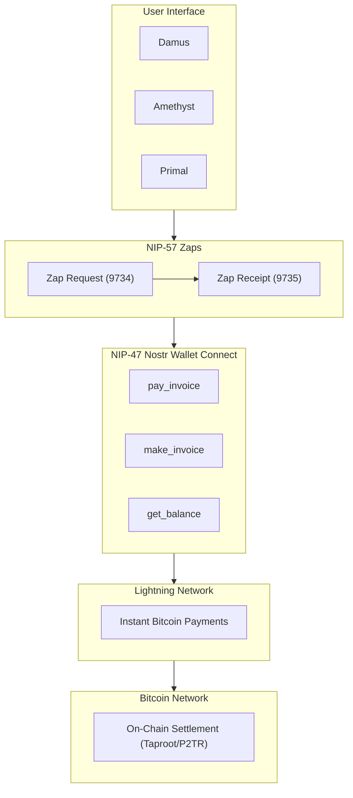

# Payments on Nostr

Nostr enables Bitcoin-based payments at every layer - from instant Lightning zaps to native on-chain Taproot transactions. This overview covers all payment methods available in the ecosystem.

## Nostr is Taproot Native

The key insight: **Nostr and Bitcoin Taproot use the same cryptography** (secp256k1 with x-only public keys). Your Nostr identity can directly hold and transfer Bitcoin.

```
npub1... (Nostr) → bc1p... (Bitcoin P2TR)
Same key, different encoding
```

## Payment Methods Comparison

| Method | Speed | Best For | Learn More |
|--------|-------|----------|------------|
| [Lightning Zaps](/payments/zaps) | Instant | Tipping, social signals | NIP-57 |
| [Lightning Direct](/payments/lightning-network) | Instant | Larger payments | BOLT11 |
| [On-Chain P2TR](/payments/onchain) | 10-60 min | Large amounts, savings | Taproot |

## How Payments Flow

### Zap Flow (Most Common)

```
1. Alice sees Bob's post
2. Alice clicks ⚡ and selects 1000 sats
3. Alice's client creates a Zap Request (kind 9734)
4. Bob's LNURL endpoint receives request
5. LNURL returns a Lightning invoice
6. Alice's wallet pays the invoice
7. Bob's wallet publishes Zap Receipt (kind 9735)
8. Receipt appears on Bob's post
```

### On-Chain Flow (Large Amounts)

```
1. Alice wants to pay Bob 0.1 BTC
2. Alice derives Bob's P2TR address from his npub
3. Alice creates and signs transaction
4. Transaction broadcasts to Bitcoin network
5. Confirmation in ~10 minutes
6. Optionally: Alice posts receipt on Nostr
```

## Value for Value

Nostr finance operates on the **Value for Value** (V4V) model:

:::tip V4V Principles
1. **Content is freely available** - No paywalls
2. **Payments are voluntary** - Pay what you think it's worth
3. **Direct to creator** - No platform middleman
4. **Immediate settlement** - Via Lightning Network
:::

### V4V vs Traditional Models

| Aspect | Traditional | Value for Value |
|--------|-------------|-----------------|
| Access | Paywall/subscription | Free |
| Revenue | Forced payment | Voluntary |
| Friction | High (signup, payment) | Low (one-click zap) |
| Privacy | Data collection | Minimal data |
| Middleman | Platform takes 30%+ | Direct payments |

## Payment Infrastructure

### Required Components

1. **Nostr Client** - User interface
2. **Lightning Wallet** - For instant payments
3. **NWC Connection** - Links wallet to client
4. **Relays** - Transmit payment events
5. **Bitcoin Address** - For on-chain (derived from npub)

### Architecture Diagram



## Common Payment Amounts

Typical zap amounts and their meanings:

| Amount | Common Usage |
|--------|--------------|
| 21 sats | Symbolic tip (21M BTC cap) |
| 69 sats | Playful tip |
| 100 sats | Small appreciation |
| 420 sats | Fun tip |
| 1,000 sats | Solid tip (~$1) |
| 2,100 sats | Generous tip |
| 5,000 sats | Very generous |
| 10,000+ sats | Exceptional content |

## Payment Events Reference

| Kind | Name | Purpose |
|------|------|---------|
| 9734 | Zap Request | Initiates a zap |
| 9735 | Zap Receipt | Proves payment |
| 9041 | Zap Goal | Crowdfunding target |

## Receiving Payments

### Lightning Address (for Zaps)

Add to your profile (kind 0):
```json
{
  "lud16": "yourname@walletservice.com"
}
```

### Bitcoin Address (for On-Chain)

Add P2TR address derived from your npub:
```json
{
  "bitcoin": "bc1p..."
}
```

### LNURL (Alternative)

```json
{
  "lud06": "https://service.com/.well-known/lnurlp/username"
}
```

## Further Reading

- [Zaps Deep Dive](/payments/zaps)
- [Lightning Network](/payments/lightning-network)
- [On-Chain Payments](/payments/onchain)
- [Subscriptions](/payments/subscriptions)
- [Crowdfunding](/payments/crowdfunding)

---

:::info Taproot Native
Because Nostr uses the same cryptography as Bitcoin Taproot, your identity IS your wallet. No bridges, no wrapping - just native Bitcoin on both layers.
:::
