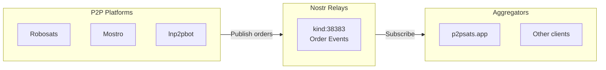
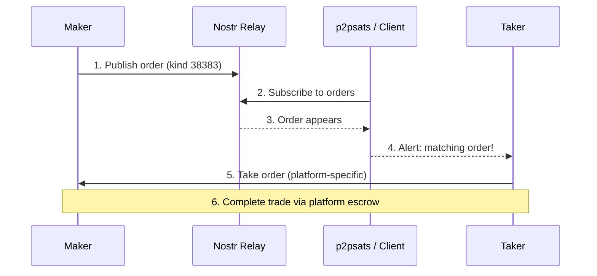
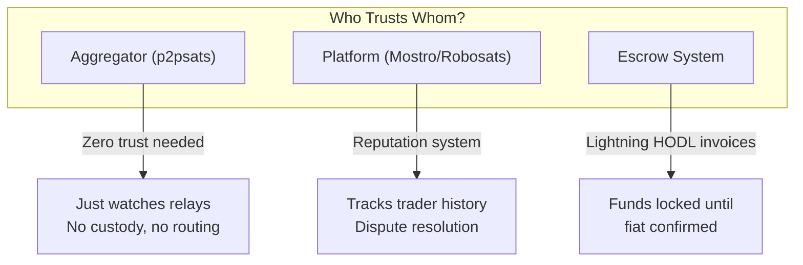

# P2P Bitcoin Trading

Nostr enables decentralized peer-to-peer Bitcoin trading through [NIP-69](/nips/nip-69), allowing users to buy and sell Bitcoin for fiat currencies without centralized exchanges.

## The Fragmentation Problem

Today's P2P Bitcoin market is siloed:

| Platform | Visibility | Problem |
|----------|------------|---------|
| Robosats | Robosats users only | Miss buyers on other platforms |
| lnp2pbot | Telegram users only | Limited discovery |
| Mostro | Mostro users only | Fragmented liquidity |
| Peach | Peach app only | Separate order book |

A seller posting a discount offer on one platform might miss eager buyers on another. NIP-69 fixes this by creating an open, interoperable order format.

## How NIP-69 Works

NIP-69 defines a standard event format (kind 38383) for P2P trade orders:



### Order Event Structure

```json
{
  "kind": 38383,
  "pubkey": "maker_pubkey",
  "content": "encrypted_trade_details",
  "tags": [
    ["d", "order_id"],
    ["k", "sell"],
    ["f", "EUR"],
    ["s", "pending"],
    ["amt", "100000-500000"],
    ["fa", "100-500"],
    ["pm", "revolut", "sepa"],
    ["premium", "-2"],
    ["network", "lightning"],
    ["expiration", "1704067200"]
  ]
}
```

### Key Tags

| Tag | Description | Example |
|-----|-------------|---------|
| `k` | Order kind (buy/sell) | `sell` |
| `f` | Fiat currency | `EUR`, `USD` |
| `s` | Status | `pending`, `active` |
| `amt` | Sats amount (range) | `100000-500000` |
| `fa` | Fiat amount (range) | `100-500` |
| `pm` | Payment methods | `revolut`, `sepa` |
| `premium` | Price premium % | `-2` (2% discount) |
| `network` | Settlement network | `lightning`, `onchain` |

## The Trade Flow



The key insight: **aggregators don't handle trades** - they just surface orders. Actual trade execution happens through the originating platform's escrow system.

## Aggregators

### p2psats.app

[p2psats](https://p2psats.app) aggregates NIP-69 orders from four platform relays:

**Relays:**
- `wss://relay.mostro.network`
- `wss://relay.lnp2pbot.com`
- `wss://nostr.robosats.org`
- `wss://relay.peachbitcoin.com`

**Features:**
- Unified order book across ~140 fiat currencies
- Depth charts with Yadio reference pricing
- Spread/mid-price analysis
- Cross-platform arbitrage detection
- Custom alerts (side/currency/amount/premium)
- Notifications via email or NIP-17 DMs
- NIP-07 or magic link authentication
- No custody, no fees, no account required

**Example Alert:**
> "Notify me when there's a sell order in EUR under +3% premium for ≥100k sats"

When a matching order hits a relay, you get pinged instantly.

### Building Your Own

Since NIP-69 is an open spec, anyone can build aggregators:

```javascript
// Subscribe to P2P orders
const filter = {
  kinds: [38383],
  "#f": ["EUR"],  // Filter by fiat currency
  "#k": ["sell"], // Only sell orders
  since: Math.floor(Date.now() / 1000) - 86400 // Last 24h
};

pool.subscribeMany(relays, [filter], {
  onevent(event) {
    const premium = event.tags.find(t => t[0] === 'premium')?.[1];
    if (parseFloat(premium) < 3) {
      notify("Good deal found!");
    }
  }
});
```

## P2P Platforms on Nostr

### Mostro

Nostr-native P2P exchange:
- Built entirely on Nostr (NIP-59 GiftWrap for privacy)
- Lightning hold invoice escrow
- Built-in dispute resolution
- [mostro.network](https://mostro.network)

### RoboSats

Privacy-focused P2P:
- Tor-based with federation
- Maintains [robosats-nostr-sync](https://github.com/RoboSats/robosats-nostr-sync) scraper
- Also aggregates HodlHodl and Peach orders to Nostr
- [robosats.com](https://robosats.com)

### lnp2pBot

Telegram-based trading:
- Bot-mediated via @lnp2pBot
- Lightning hold invoice escrow
- No registration or KYC
- [lnp2pbot.com](https://lnp2pbot.com)

### Peach Bitcoin

Mobile P2P app:
- iOS and Android native
- No KYC required
- GroupHug batched transactions
- [peachbitcoin.com](https://peachbitcoin.com)

## Trust Model



**Aggregators are trustless** - they never touch funds or route orders. They just read public events and notify you.

**Platforms handle escrow** - each platform has its own escrow mechanism (usually Lightning HODL invoices) and reputation system.

## Privacy Considerations

### Order Privacy

- Order content can be encrypted (platform-specific)
- Aggregators only see public order metadata
- Trade negotiation happens via encrypted DMs (NIP-17)

### Identity

- Can trade pseudonymously (just an npub)
- NIP-07 sign-in exposes no email/password
- Reputation tied to npub, portable across platforms

## Getting Started

### As a Trader

1. **Choose a platform** - Mostro, Robosats, or lnp2pbot
2. **Set up alerts** - Use p2psats for cross-platform visibility
3. **Start small** - Build reputation with small trades
4. **Use Lightning** - Faster settlements, lower fees

### As a Developer

1. **Study NIP-69** - [Full specification](/nips/nip-69)
2. **Subscribe to relays** - `wss://relay.mostro.network`, etc.
3. **Parse order events** - Extract tags, filter by criteria
4. **Build UX** - Alerts, aggregation, analytics

## Comparison with Centralized Exchanges

| Aspect | CEX | NIP-69 P2P |
|--------|-----|------------|
| KYC | Required | Optional |
| Custody | Exchange holds funds | Self-custody until trade |
| Fees | 0.1-0.5% + withdrawal | Platform-specific (often lower) |
| Privacy | Full identity | Pseudonymous |
| Censorship | Account can be frozen | Permissionless |
| Liquidity | High | Growing |

## See Also

- [NIP-69 Specification](/nips/nip-69)
- [Lightning Network](/payments/lightning-network)
- [Marketplaces Overview](/marketplaces/overview)

---

:::tip Cross-Platform Liquidity
The power of NIP-69 is network effects: as more platforms publish orders, aggregators become more valuable, which attracts more traders, which attracts more platforms. A rising tide lifts all boats.
:::
