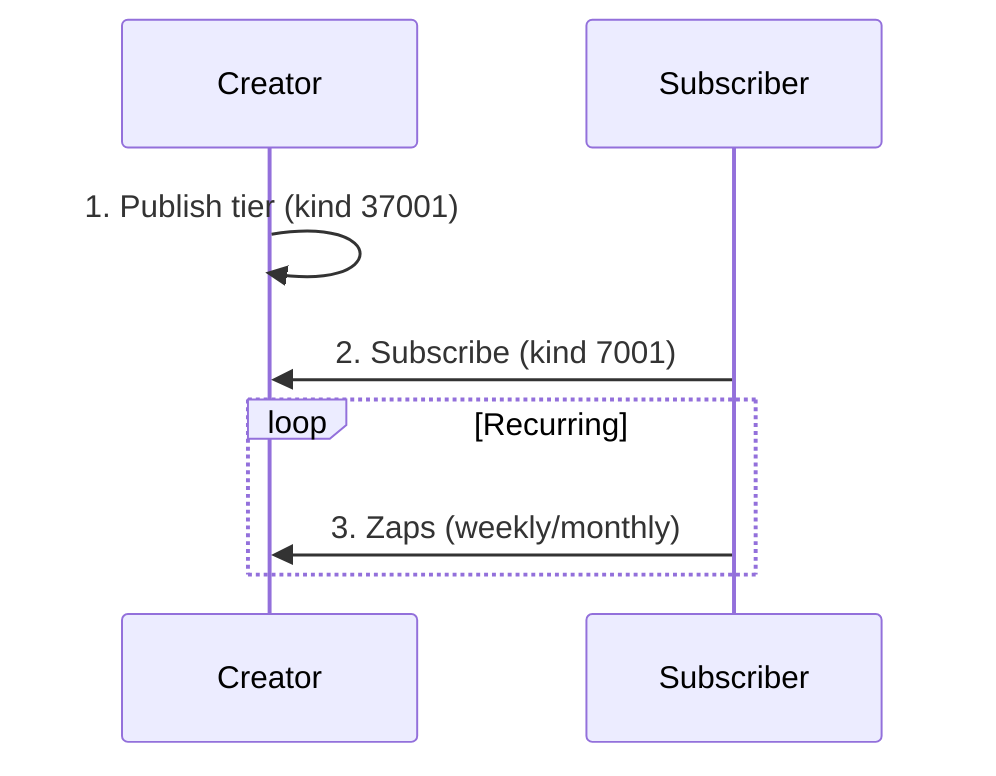

# Recurring Subscriptions

Nostr enables recurring payments through NIP-88, allowing creators to offer subscription-based content and supporters to provide ongoing funding.

## Overview

Subscriptions on Nostr work by:
1. Creator publishes subscription tiers
2. Subscriber zaps the tier event on a schedule
3. Subscription status tracked via events



## Subscription Tiers (NIP-88)

### Tier Event (kind 37001)

Creators define subscription options:

```json
{
  "kind": 37001,
  "pubkey": "creator_pubkey",
  "content": "Support my work with a monthly subscription!",
  "tags": [
    ["d", "premium-tier"],
    ["title", "Premium Supporter"],
    ["amount", "10000", "monthly"],
    ["description", "Access to premium content and early releases"],
    ["image", "https://example.com/tier-image.png"],
    ["perks", "Early access", "Exclusive posts", "Direct messages"]
  ]
}
```

| Tag | Purpose |
|-----|---------|
| `d` | Unique tier identifier |
| `title` | Tier name |
| `amount` | Sats and frequency |
| `description` | What subscriber gets |
| `perks` | List of benefits |

### Multiple Tiers Example

Creator: @alice

| Tier | Price | Perks |
|------|-------|-------|
| **Bronze** | 1,000 sats/mo | Monthly newsletter, Name in credits |
| **Silver** | 5,000 sats/mo | All Bronze perks + Early access, Exclusive posts |
| **Gold** | 21,000 sats/mo | All Silver perks + DM access, Monthly video call |

## Subscribing

### Subscription Event (kind 7001)

```json
{
  "kind": 7001,
  "pubkey": "subscriber_pubkey",
  "content": "",
  "tags": [
    ["p", "creator_pubkey"],
    ["e", "tier_event_id"],
    ["cadence", "monthly"],
    ["amount", "10000"]
  ]
}
```

The subscription event is re-zapped according to the cadence.

### Cancellation

To cancel, publish a deletion event:

```json
{
  "kind": 5,
  "tags": [
    ["e", "subscription_event_id"]
  ]
}
```

## Payment Automation

### Using NWC

Subscriptions can be automated via Nostr Wallet Connect:

1. **Set up NWC** with appropriate budget
2. **Authorize recurring payments** to specific pubkeys
3. **Wallet handles payments** on schedule

```javascript
// NWC subscription setup
const subscription = {
  recipient: "creator_pubkey",
  amount: 10000,
  cadence: "monthly",
  maxBudget: 100000
};
```

### Budget Protection

:::tip Set Spending Limits
Configure your wallet with:
- Daily/weekly/monthly limits
- Per-recipient caps
- Total subscription budget
:::

## Content Gating

Creators can gate content based on subscription status:

### Checking Subscription

```javascript
async function hasActiveSubscription(userPubkey, creatorPubkey) {
  // Get user's subscription events
  const subs = await fetchEvents({
    kinds: [7001],
    authors: [userPubkey],
    "#p": [creatorPubkey]
  });

  // Check for recent zap to tier
  const recentZap = await checkRecentZap(userPubkey, creatorPubkey);

  return subs.length > 0 && recentZap;
}
```

### Gated Content Event

```json
{
  "kind": 30023,
  "content": "encrypted_premium_content",
  "tags": [
    ["tier", "premium-tier"],
    ["preview", "This is a preview. Subscribe to read more..."]
  ]
}
```

## Value-for-Value Alternative

Not everyone needs subscriptions. The V4V model offers flexibility:

| Model | Pros | Cons |
|-------|------|------|
| Subscription | Predictable income | Barrier to entry |
| V4V (Zaps) | Frictionless | Unpredictable |
| Hybrid | Best of both | More complexity |

### Hybrid Approach

Many creators combine:
- Free content with zap option
- Premium tiers for extras
- One-time tips always welcome

## Comparison with Traditional Platforms

| Feature | Patreon | Substack | Nostr Subscriptions |
|---------|---------|----------|---------------------|
| Platform Fee | 5-12% | 10% | 0% |
| Payment | Credit card | Credit card | Bitcoin |
| Censorship | Platform rules | Platform rules | None |
| Identity | Email/password | Email | Cryptographic |
| Data Control | Platform owns | Platform owns | User owns |

## Implementation Status

:::info Draft Specification
NIP-88 for recurring subscriptions is still in draft status. Implementations may vary and the specification could change.
:::

### Current Implementations

- **Zap.stream** - Streaming with subscriptions
- **Nostr.band** - Premium features
- Various clients experimenting

## Best Practices

### For Creators

1. **Clear tier benefits** - Explain what subscribers get
2. **Reasonable pricing** - Consider your audience
3. **Deliver value** - Keep subscribers happy
4. **Acknowledge supporters** - Show appreciation

### For Subscribers

1. **Set budgets** - Use NWC limits
2. **Review subscriptions** - Cancel unused ones
3. **Understand terms** - What you're paying for
4. **Support quality** - Vote with your sats

## See Also

- [NIP-88 Specification](https://github.com/nostr-protocol/nips/pull/866)
- [Zaps](/payments/zaps)
- [Nostr Wallet Connect](/wallets/nwc)
- [Crowdfunding](/payments/crowdfunding)

---

:::tip Creator Economy
Nostr subscriptions enable a true peer-to-peer creator economy. No platform takes a cut, no algorithm controls reach, and subscribers support creators directly.
:::
