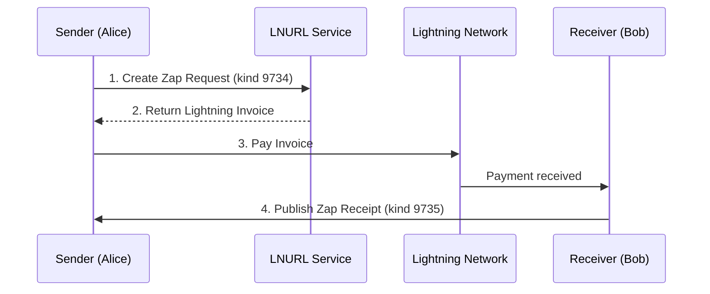

# Zaps - Lightning Payments on Nostr

Zaps are instant Bitcoin Lightning payments tied to Nostr events. Defined by [NIP-57](https://github.com/nostr-protocol/nips/blob/master/57.md), they're the most common payment method in the Nostr ecosystem.

## What Are Zaps?

Zaps are:
- **Lightning payments** sent via Nostr
- **Publicly visible** on the recipient's content
- **Cryptographically verified** by signed receipts
- **Social signals** indicating content value

:::tip Why "Zaps"?
The name comes from the lightning bolt emoji (⚡) commonly used for Lightning Network payments. Zapping is like "liking" content, but with real Bitcoin value.
:::

## How Zaps Work

### The Zap Flow



### Step-by-Step

1. **Zap Request Created**
   - Sender's client creates kind 9734 event
   - Contains: amount, recipient, event being zapped, optional message

2. **LNURL Processing**
   - Request sent to recipient's LNURL endpoint
   - Endpoint validates and returns Lightning invoice

3. **Lightning Payment**
   - Sender's wallet pays the invoice
   - Payment routes through Lightning Network

4. **Zap Receipt Published**
   - Recipient's wallet service creates kind 9735
   - Contains: proof of payment, original request
   - Published to relays for all to see

## Event Structures

### Zap Request (kind 9734)

```json
{
  "kind": 9734,
  "pubkey": "sender_pubkey",
  "created_at": 1234567890,
  "content": "Great post! 🔥",
  "tags": [
    ["p", "recipient_pubkey"],
    ["e", "event_id_being_zapped"],
    ["amount", "1000000"],
    ["relays", "wss://relay1.com", "wss://relay2.com"],
    ["lnurl", "lnurl1..."]
  ]
}
```

| Tag | Purpose |
|-----|---------|
| `p` | Recipient's public key |
| `e` | Event being zapped (optional) |
| `amount` | Amount in millisatoshis |
| `relays` | Where to publish receipt |
| `lnurl` | Recipient's LNURL |

### Zap Receipt (kind 9735)

```json
{
  "kind": 9735,
  "pubkey": "lnurl_provider_pubkey",
  "created_at": 1234567890,
  "content": "",
  "tags": [
    ["p", "recipient_pubkey"],
    ["P", "sender_pubkey"],
    ["e", "event_id_zapped"],
    ["bolt11", "lnbc1000n1..."],
    ["description", "{...zap_request...}"],
    ["preimage", "payment_preimage"]
  ]
}
```

| Tag | Purpose |
|-----|---------|
| `p` | Recipient |
| `P` | Sender (uppercase) |
| `e` | Zapped event |
| `bolt11` | Lightning invoice |
| `description` | Original zap request |
| `preimage` | Payment proof |

## Setting Up Zaps

### For Receiving

Add LNURL to your profile (kind 0):

```json
{
  "name": "YourName",
  "about": "Nostr user",
  "lud16": "yourname@getalby.com"
}
```

Or use raw LNURL:
```json
{
  "lud06": "lnurl1dp68gurn8ghj7..."
}
```

### For Sending

1. Connect a Lightning wallet via NWC
2. Ensure sufficient balance
3. Click the ⚡ button on any post

## Zap Amounts & Etiquette

### Common Amounts

| Sats | USD (approx) | Meaning |
|------|--------------|---------|
| 21 | $0.02 | Symbolic gesture |
| 100 | $0.10 | Small tip |
| 500 | $0.50 | Nice appreciation |
| 1,000 | $1.00 | Good tip |
| 2,100 | $2.10 | Generous |
| 5,000 | $5.00 | Very generous |
| 10,000 | $10.00 | Exceptional |
| 21,000 | $21.00 | Maximal |

### Zap Messages

Include a message to make zaps more meaningful:
- "Great thread!"
- "This helped me understand X"
- "Keep up the good work"

## Zaps as Social Signals

### Aggregation

Clients typically show:
- Total sats received
- Number of zaps
- Top zappers

```
⚡ 42,069 sats (23 zaps)
```

### Quality Indicators

High zap counts signal:
- Valuable content
- Community approval
- Engagement quality

## Advanced Features

### Zapping Events vs Profiles

- **Event zaps**: Tip specific posts
- **Profile zaps**: General support for a user

### Anonymous Zaps

Some clients support anonymous zapping:
- Sender identity hidden
- Uses anonymous pubkey
- Still publicly visible on content

## Common Issues

### Zaps Not Appearing

1. **Check relay connectivity** - Receipts need relay propagation
2. **Wait a moment** - Network latency
3. **Check LNURL** - Recipient setup may be wrong

### Can't Send Zaps

1. **Wallet not connected** - Set up NWC
2. **Insufficient balance** - Fund your wallet
3. **LNURL error** - Recipient issue

### LNURL Not Working

1. **Domain issues** - HTTPS required
2. **Configuration** - Check wallet service
3. **Rate limits** - Some services limit requests

## Implementations

### Wallets with Zap Support

- **Alby** - Browser extension, NWC
- **Zeus** - Mobile, self-custodial
- **Mutiny** - Web wallet
- **Phoenix** - Mobile Lightning

### Clients with Zaps

- **Damus** - iOS native
- **Amethyst** - Android
- **Primal** - Web/mobile
- **Nostrudel** - Web
- **Coracle** - Web

## See Also

- [NIP-57 Specification](https://github.com/nostr-protocol/nips/blob/master/57.md)
- [Lightning Network](/payments/lightning-network)
- [Nostr Wallet Connect](/wallets/nwc)
- [On-Chain Payments](/payments/onchain)

---

:::info Zaps reached 1 million
On June 16, 2023, Nostr zaps crossed 1 million transactions - just four months after the feature launched. This demonstrated strong demand for micropayments in social media.
:::
