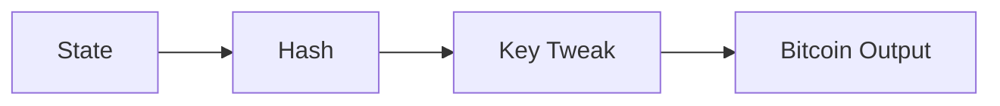
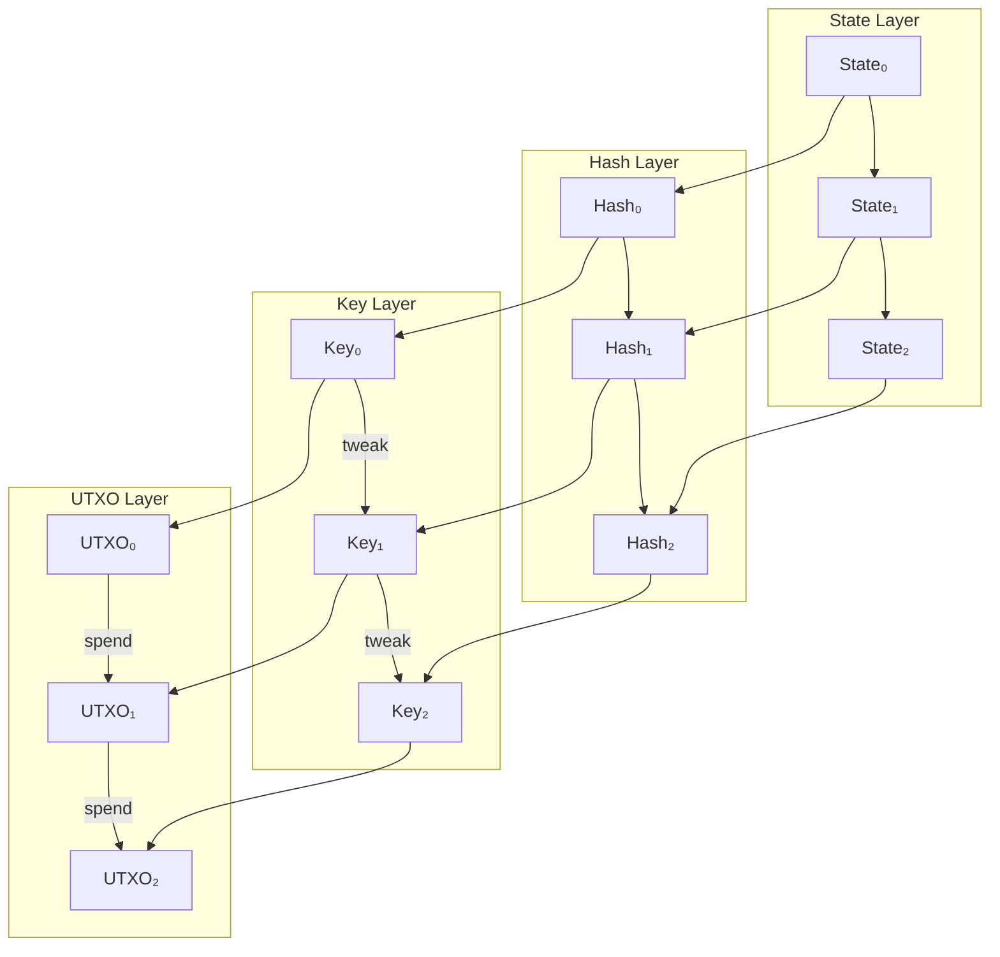
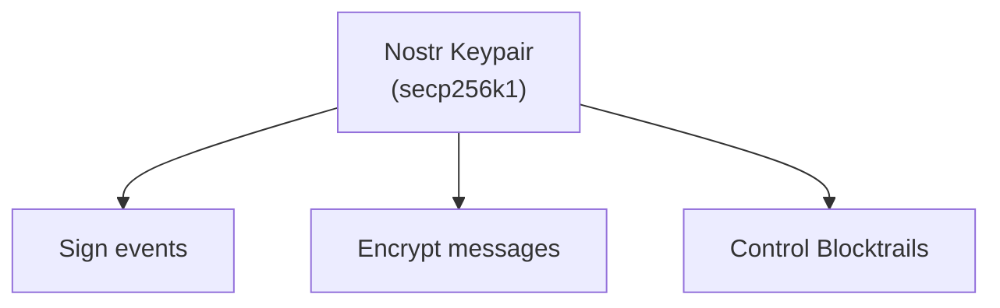
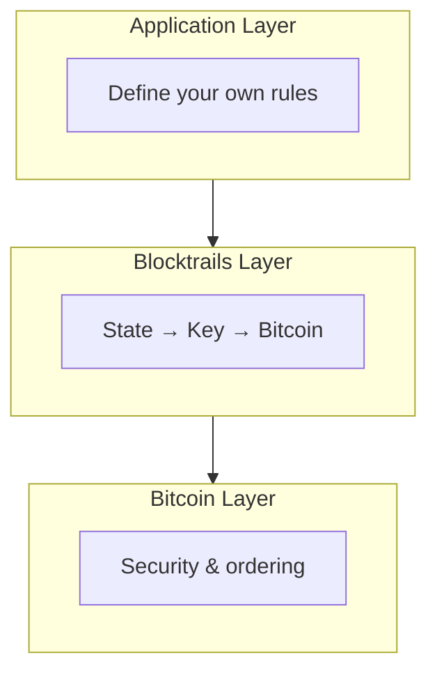

# Blocktrails

[Blocktrails](https://blocktrails.org) is a system for anchoring evolving state to Bitcoin using cryptographic keys and hashes. It enables "Nostr-native state on Bitcoin" without requiring new tokens, sidechains, or consensus rules.

## Overview

Blocktrails provides:
- **State anchoring** - Commit any state to Bitcoin
- **Verifiable history** - Cryptographic chain of changes
- **Nostr integration** - Use secp256k1 keys
- **Minimal footprint** - One P2TR output per update



## How It Works

### Key Tweaking

Each state update creates a new key by tweaking:

```
1. Hash your state data
2. Use hash as tweak value
3. Add tweak to previous private key
4. New public key becomes P2TR output
5. Repeat for each update
```

### Visual Flow



The spend chain mirrors the key chain, creating verifiable history.

### Single-Use Seal Pattern

```
Bitcoin guarantees:
- Each UTXO can only be spent once
- Spending reveals the witness (signature)
- Only one valid history exists
```

## Technical Details

### State Commitment

```javascript
// Commit state to a key
function commitState(prevPrivkey, state) {
  const stateHash = sha256(serialize(state));
  const tweak = stateHash;
  const newPrivkey = tweakPrivateKey(prevPrivkey, tweak);
  const newPubkey = getPublicKey(newPrivkey);
  return { newPrivkey, newPubkey, stateHash };
}
```

### P2TR Output

The tweaked public key becomes a Taproot output:

```
OP_1 <tweaked_pubkey>
```

Key-path spend only—no scripts required.

### Verification

Anyone with the state history can verify:

```javascript
function verifyChain(states, initialPubkey) {
  let currentPubkey = initialPubkey;

  for (const state of states) {
    const stateHash = sha256(serialize(state));
    currentPubkey = tweakPublicKey(currentPubkey, stateHash);
  }

  // Check against current UTXO
  return currentPubkey === currentUtxoPubkey;
}
```

## Nostr Integration

### Native secp256k1 Keys

Blocktrails uses the same curve as Nostr:



Your Nostr identity can directly own Blocktrails.

### State Storage

While Bitcoin stores commitments, actual state lives off-chain:

| Storage | Use Case |
|---------|----------|
| Nostr relays | Social/ephemeral state |
| Git repos | Code/documents |
| IPFS | Large files |
| Self-hosted | Private data |

### Publishing State

```json
{
  "kind": 30078,
  "pubkey": "controller_pubkey",
  "content": "{\"state\":\"...\",\"commitment\":\"btc_txid\"}",
  "tags": [
    ["d", "my-blocktrail"],
    ["t", "blocktrail"],
    ["r", "bitcoin:txid"]
  ]
}
```

## Use Cases

### Token Ledgers

Track token ownership:

```javascript
const tokenState = {
  version: 1,
  balances: {
    "did:nostr:alice": 1000,
    "did:nostr:bob": 500
  }
};

// Commit to Bitcoin
const commitment = commitState(prevKey, tokenState);
```

### Version Control

Anchor code/document versions:

```javascript
const repoState = {
  branch: "main",
  commitHash: "abc123...",
  timestamp: Date.now()
};
```

### Voting Systems

Record votes immutably:

```javascript
const voteState = {
  proposalId: "prop-001",
  votes: {
    yes: 150,
    no: 50
  },
  finalized: true
};
```

### Audit Trails

Compliance record-keeping:

```javascript
const auditState = {
  period: "2024-Q1",
  checksum: "sha256:...",
  auditor: "did:nostr:..."
};
```

### Game State

Provably fair game records:

```javascript
const gameState = {
  gameId: "chess-001",
  moves: ["e4", "e5", "Nf3"],
  result: "ongoing"
};
```

### IoT Logs

Device attestation:

```javascript
const iotLog = {
  deviceId: "sensor-001",
  readings: [...],
  signature: "..."
};
```

## Architecture

### Minimal Design



### SPV Compatible

Verification works with merkle proofs:
- No full node required
- Light clients can verify
- Mobile-friendly

### Composable

Blocktrails is a primitive:
- Applications define semantics
- Multiple protocols can share
- Interoperable by design

## Benefits

### vs. Sidechains

| Aspect | Sidechain | Blocktrails |
|--------|-----------|-------------|
| New token | Usually | No |
| New consensus | Yes | No |
| Security | Varies | Bitcoin |
| Complexity | High | Low |

### vs. Colored Coins

| Aspect | Colored Coins | Blocktrails |
|--------|---------------|-------------|
| Protocol | Complex | Simple |
| Validation | Specialized | Secp256k1 |
| State | On-chain | Off-chain |

## Implementation

### Basic Example

```javascript
import { tweakPrivateKey, tweakPublicKey } from 'secp256k1-utils';
import { sha256 } from 'crypto';

class Blocktrail {
  constructor(initialPrivkey) {
    this.privkey = initialPrivkey;
    this.history = [];
  }

  commit(state) {
    const stateHash = sha256(JSON.stringify(state));
    this.privkey = tweakPrivateKey(this.privkey, stateHash);

    this.history.push({
      state,
      hash: stateHash,
      timestamp: Date.now()
    });

    return this.getPubkey();
  }

  getPubkey() {
    return getPublicKey(this.privkey);
  }

  getHistory() {
    return this.history;
  }
}

// Usage
const trail = new Blocktrail(initialPrivkey);
const newPubkey = trail.commit({ balance: 1000 });
// Create Bitcoin tx spending to newPubkey
```

## Security Considerations

### Key Management

- Private key controls the trail
- Secure as any Bitcoin key
- Lost key = lost trail control

### State Availability

- Bitcoin only stores commitments
- State must be preserved elsewhere
- Consider redundant storage

### Verification Requirements

- Need full state history to verify
- Proofs grow with updates
- May need periodic checkpointing

## Resources

- [Blocktrails Specification](https://blocktrails.org)
- [Single-Use Seals](https://petertodd.org/2016/commitments-and-single-use-seals)
- [Taproot/P2TR](https://bitcoinops.org/en/topics/taproot/)

---

:::tip Bitcoin as Timechain
Blocktrails leverages Bitcoin's true superpower—not just value transfer, but trustless ordering and timestamping. Any linear state machine can be anchored to Bitcoin's timechain.
:::
