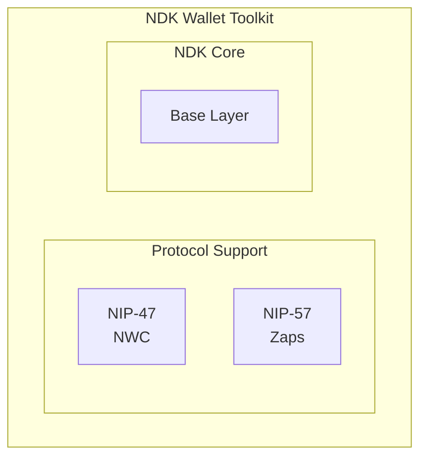

# NDK Wallet Toolkit

The `@nostr-dev-kit/ndk-wallet` package provides a comprehensive wallet toolkit for building Nostr finance applications. It implements NIP-47 (NWC) and NIP-57 (Zaps) specifications.

## Overview

NDK Wallet is designed for developers building:
- Nostr clients with wallet features
- Financial applications on Nostr
- NWC-enabled services
- Lightning payment integrations



## Installation

```bash
npm install @nostr-dev-kit/ndk-wallet
# or
yarn add @nostr-dev-kit/ndk-wallet
```

## Features

| Feature | Description | NIP |
|---------|-------------|-----|
| NWC Client | Connect to wallets via NWC | NIP-47 |
| Zap Support | Send and receive zaps | NIP-57 |
| Lightning | Lightning invoice management | - |
| Balance | Check wallet balances | NIP-47 |

## NWC Client

### Connecting to a Wallet

```typescript
import NDK from '@nostr-dev-kit/ndk';
import { NDKNWCWallet } from '@nostr-dev-kit/ndk-wallet';

const ndk = new NDK({
  explicitRelayUrls: ['wss://relay.damus.io']
});
await ndk.connect();

// Create NWC wallet from connection string
const wallet = new NDKNWCWallet(ndk);
await wallet.connect('nostr+walletconnect://...');
```

### Paying Invoices

```typescript
// Pay a Lightning invoice
const result = await wallet.pay({
  invoice: 'lnbc1000n1...'
});

console.log('Payment preimage:', result.preimage);
```

### Creating Invoices

```typescript
// Generate invoice
const invoice = await wallet.createInvoice({
  amount: 1000, // sats
  description: 'Test payment'
});

console.log('Pay this:', invoice.invoice);
```

### Checking Balance

```typescript
const balance = await wallet.getBalance();
console.log('Balance:', balance, 'sats');
```

## Zap Integration

### Sending Zaps

```typescript
import { zapEvent } from '@nostr-dev-kit/ndk-wallet';

// Zap an event
const event = await ndk.fetchEvent('nevent1...');
const zapResult = await zapEvent(event, wallet, {
  amount: 1000,
  comment: 'Great post!'
});
```

### Checking Zap Receipts

```typescript
// Get zaps for an event
const zaps = await event.zaps();
const totalSats = zaps.reduce((sum, z) => sum + z.amount, 0);
console.log('Total zapped:', totalSats);
```

## Wallet State Management

### Connection Persistence

NWC connection strings can be stored securely:

```typescript
// Store connection string securely
localStorage.setItem('nwc_connection', connectionString);

// Reconnect on app load
const stored = localStorage.getItem('nwc_connection');
if (stored) {
  await wallet.connect(stored);
}
```

## Complete Example

```typescript
import NDK from '@nostr-dev-kit/ndk';
import { NDKNWCWallet } from '@nostr-dev-kit/ndk-wallet';

async function main() {
  // Initialize NDK
  const ndk = new NDK({
    explicitRelayUrls: [
      'wss://relay.damus.io',
      'wss://nos.lol'
    ]
  });
  await ndk.connect();

  // Set user (for signing/encryption)
  ndk.signer = yourSigner;

  // Connect NWC Wallet
  const wallet = new NDKNWCWallet(ndk);
  await wallet.connect('nostr+walletconnect://...');

  // Check balance
  const balance = await wallet.getBalance();
  console.log('Wallet Balance:', balance, 'sats');

  // Create an invoice
  const invoice = await wallet.createInvoice({
    amount: 1000,
    description: 'Test payment'
  });
  console.log('Invoice:', invoice.invoice);

  // Pay an invoice
  const result = await wallet.pay({ invoice: 'lnbc...' });
  console.log('Payment preimage:', result.preimage);
}

main();
```

## Configuration Options

### NDKNWCWallet Options

```typescript
const wallet = new NDKNWCWallet(ndk, {
  timeout: 30000, // Request timeout
  budgetSats: 100000, // Optional client-side budget
});
```

## Error Handling

```typescript
try {
  await wallet.pay({ invoice });
} catch (error) {
  if (error.code === 'INSUFFICIENT_BALANCE') {
    console.log('Not enough funds');
  } else if (error.code === 'PAYMENT_FAILED') {
    console.log('Lightning routing failed');
  } else {
    console.log('Unknown error:', error.message);
  }
}
```

## Resources

- [NDK Documentation](https://ndk.fyi)
- [GitHub Repository](https://github.com/nostr-dev-kit/ndk)
- [NPM Package](https://www.npmjs.com/package/@nostr-dev-kit/ndk-wallet)
- [NIP-47 Spec](https://github.com/nostr-protocol/nips/blob/master/47.md)
- [NIP-57 Spec](https://github.com/nostr-protocol/nips/blob/master/57.md)

---

:::tip Developer Tool
NDK Wallet abstracts away the complexity of Nostr finance protocols. Focus on your application logic while NDK handles the NIP implementations.
:::
