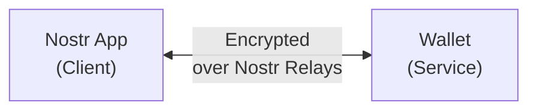
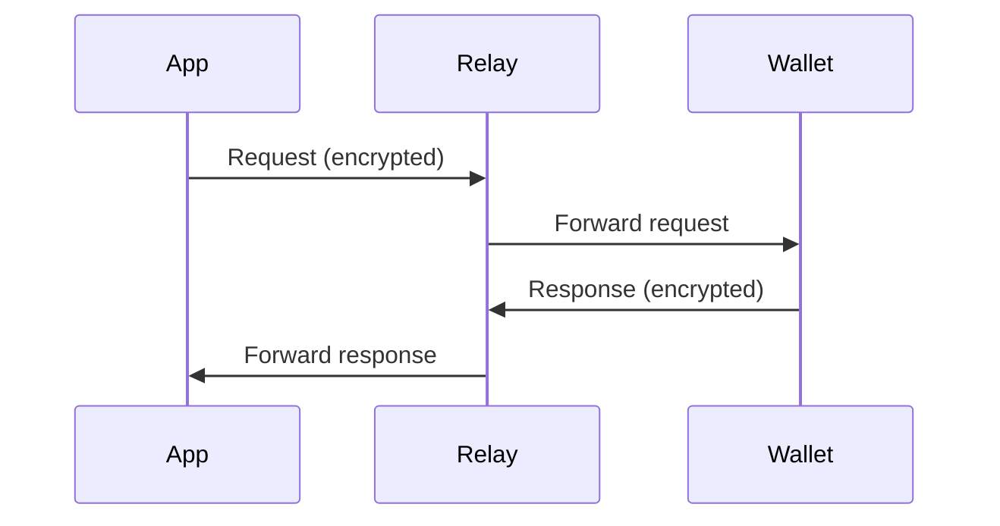

# Nostr Wallet Connect (NWC)

Nostr Wallet Connect (NWC) is an open protocol that enables Nostr apps to interact with Lightning wallets. Defined by [NIP-47](https://github.com/nostr-protocol/nips/blob/master/47.md), it's the standard for wallet connectivity in the Nostr ecosystem.

## What is NWC?

NWC provides:
- **Standardized communication** between apps and wallets
- **Encrypted messages** via Nostr relays
- **Budget controls** for spending limits
- **Cross-platform compatibility**



## How NWC Works

### Connection Flow

1. **Wallet generates connection string**
2. **User imports into app**
3. **App sends encrypted requests**
4. **Wallet processes and responds**

### Communication

All messages are NIP-04 encrypted Nostr events:



The relay only sees encrypted blobs - it can't read payment details.

## Connection String Format

```
nostr+walletconnect://[wallet_pubkey]?
  relay=[relay_url]&
  secret=[shared_secret]&
  lud16=[optional_lightning_address]
```

### Components

| Component | Purpose |
|-----------|---------|
| `wallet_pubkey` | Wallet's Nostr public key |
| `relay` | Relay for communication |
| `secret` | Encryption key (hex) |
| `lud16` | Optional Lightning address |

### Example

```
nostr+walletconnect://b889ff5b1513b641e2a139f661a661364979c5beee91842f8f0ef42ab558e9d4?
  relay=wss%3A%2F%2Frelay.getalby.com%2Fv1&
  secret=71a8c14c1407c113601079c4302dab36460f0ccd0ad506f1f2dc73b5100e4f3c
```

## NWC Commands

### pay_invoice

Pay a Lightning invoice:

```json
{
  "method": "pay_invoice",
  "params": {
    "invoice": "lnbc1000n1..."
  }
}
```

Response:
```json
{
  "result_type": "pay_invoice",
  "result": {
    "preimage": "payment_preimage_hex"
  }
}
```

### make_invoice

Create an invoice:

```json
{
  "method": "make_invoice",
  "params": {
    "amount": 1000,
    "description": "Payment for service",
    "expiry": 3600
  }
}
```

Response:
```json
{
  "result_type": "make_invoice",
  "result": {
    "invoice": "lnbc1000n1...",
    "payment_hash": "..."
  }
}
```

### get_balance

Check wallet balance:

```json
{
  "method": "get_balance",
  "params": {}
}
```

Response:
```json
{
  "result_type": "get_balance",
  "result": {
    "balance": 50000
  }
}
```

### get_info

Get wallet information:

```json
{
  "method": "get_info",
  "params": {}
}
```

Response:
```json
{
  "result_type": "get_info",
  "result": {
    "alias": "My Wallet",
    "color": "#ff9900",
    "pubkey": "node_pubkey",
    "network": "mainnet",
    "methods": ["pay_invoice", "make_invoice", "get_balance"]
  }
}
```

### lookup_invoice

Check invoice status:

```json
{
  "method": "lookup_invoice",
  "params": {
    "payment_hash": "..."
  }
}
```

### list_transactions

Get transaction history:

```json
{
  "method": "list_transactions",
  "params": {
    "limit": 10,
    "offset": 0
  }
}
```

## Event Kinds

| Kind | Purpose |
|------|---------|
| 23194 | NWC Request (app → wallet) |
| 23195 | NWC Response (wallet → app) |
| 13194 | NWC Info event |

## Setting Up NWC

### Wallet Side (Service)

1. Generate keypair for NWC connections
2. Set up relay for communication
3. Generate connection strings for users
4. Process incoming requests
5. Send encrypted responses

### App Side (Client)

1. Parse connection string
2. Store wallet pubkey and secret
3. Subscribe to response events
4. Send encrypted requests
5. Handle responses

### Example: Connecting Alby to Damus

1. **In Alby**:
   - Go to Settings → Connections
   - Create new app connection
   - Copy NWC connection string

2. **In Damus**:
   - Go to Settings → Wallet
   - Select "Nostr Wallet Connect"
   - Paste connection string
   - Test with small zap

## Budget Controls

Wallets can implement spending limits:

```javascript
const connection = {
  budgetMsat: 100000000, // 100,000 sats
  budgetRenewal: "monthly",
  singlePaymentLimit: 10000000 // 10,000 sats max per payment
};
```

:::tip Security Practice
Always set a reasonable budget when creating NWC connections. This limits damage if the connection is compromised.
:::

## Error Handling

### Error Response Format

```json
{
  "result_type": "pay_invoice",
  "error": {
    "code": "INSUFFICIENT_BALANCE",
    "message": "Not enough funds"
  }
}
```

### Common Error Codes

| Code | Meaning |
|------|---------|
| `RATE_LIMITED` | Too many requests |
| `NOT_IMPLEMENTED` | Method not supported |
| `INSUFFICIENT_BALANCE` | Not enough funds |
| `PAYMENT_FAILED` | Lightning payment failed |
| `NOT_FOUND` | Invoice not found |
| `QUOTA_EXCEEDED` | Budget limit reached |
| `RESTRICTED` | Permission denied |
| `UNAUTHORIZED` | Invalid connection |
| `INTERNAL` | Server error |

## Implementations

### Wallet Services

- **Alby** - Full NWC support
- **Alby Hub** - Self-hosted NWC
- **Mutiny** - NWC enabled
- **LNbits** - NWC extension
- **Zeus** - Mobile NWC

### Libraries

- **@getalby/sdk** - JavaScript SDK
- **nwc** - Rust library
- **nostr-tools** - TypeScript utilities
- **NDK** - Nostr Development Kit

### Example Code

```javascript
import { webln } from '@getalby/sdk';

// Connect via NWC
const nwc = new webln.NWC({
  nostrWalletConnectUrl: 'nostr+walletconnect://...'
});

await nwc.enable();

// Pay invoice
const result = await nwc.sendPayment('lnbc1000n1...');
console.log('Payment preimage:', result.preimage);

// Get balance
const balance = await nwc.getBalance();
console.log('Balance:', balance.balance, 'sats');
```

## Security Considerations

### Connection String Safety

- Treat like a password
- Don't share publicly
- Regenerate if compromised
- Use separate connections per app

### Relay Trust

The relay can see:
- That communication is happening
- Event kinds and pubkeys
- Cannot read encrypted content

### Revocation

To revoke access:
1. Delete the connection in wallet
2. Wallet stops responding to requests
3. App can no longer make payments

## Resources

- [NWC Documentation](https://nwc.dev)
- [NIP-47 Specification](https://github.com/nostr-protocol/nips/blob/master/47.md)
- [Alby NWC Guide](https://guides.getalby.com)
- [Awesome NWC](https://github.com/getAlby/awesome-nwc)

---

:::info Universal Protocol
NWC eliminates the need for apps to integrate with each wallet individually. One protocol connects any app to any compatible wallet.
:::
