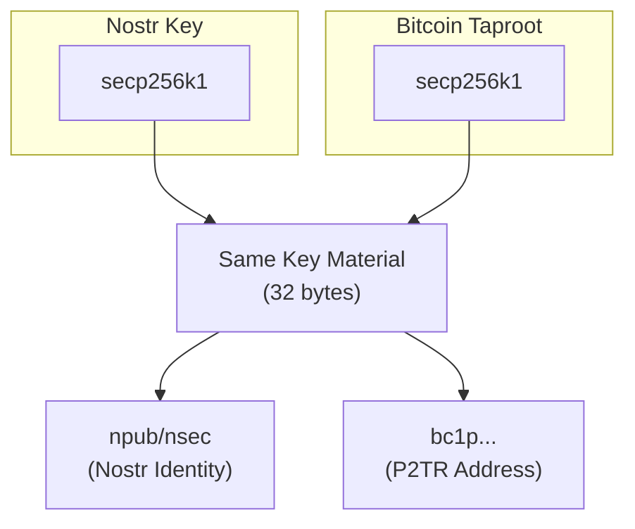

# Taproot Wallets

Nostr is **Taproot native**. Both Nostr and Bitcoin Taproot use the same secp256k1 cryptography, meaning your Nostr keypair can directly control Bitcoin via Pay-to-Taproot (P2TR) addresses.

## Why Nostr is Taproot Native

### Shared Cryptography



### Key Relationship

| Component | Nostr | Bitcoin Taproot |
|-----------|-------|-----------------|
| Curve | secp256k1 | secp256k1 |
| Private Key | nsec (32 bytes) | Same 32 bytes |
| Public Key | npub (x-only) | x-only pubkey |
| Address | npub1... | bc1p... |

## Pay-to-Taproot (P2TR)

### What is P2TR?

P2TR (BIP-341) is the native SegWit v1 output type:

- **Single-sig**: Spend with just a signature (key path)
- **Multi-sig**: Complex scripts hidden until spent (script path)
- **Privacy**: All spends look identical on-chain
- **Efficiency**: Smaller transactions, lower fees

### P2TR Address Structure

`bc1p` + 32-byte x-only pubkey (Bech32m encoded) = Same pubkey as your Nostr npub

### Deriving P2TR from Nostr Key

```javascript
import { getPublicKey } from 'nostr-tools';
import * as bitcoin from 'bitcoinjs-lib';

// Your Nostr private key (nsec decoded)
const privateKey = hexToBytes('your-private-key-hex');

// Get x-only public key (same for Nostr and Taproot)
const pubkey = getPublicKey(privateKey);

// Create P2TR address
const { address } = bitcoin.payments.p2tr({
  internalPubkey: Buffer.from(pubkey, 'hex'),
  network: bitcoin.networks.bitcoin,
});

console.log(address); // bc1p...
```

## Using Nostr Keys for Bitcoin

### Direct Key Usage

Your Nostr identity can directly receive Bitcoin:

1. **Derive P2TR address** from your npub
2. **Share address** for receiving payments
3. **Sign transactions** with your nsec
4. **Spend Bitcoin** using the same key

### Security Considerations

:::warning Key Reuse
While technically possible, using the same key for both Nostr signing and Bitcoin spending has tradeoffs:

- **Pro**: Single key to manage, unified identity
- **Con**: Nostr signatures could theoretically leak information
- **Recommendation**: Use derived keys for Bitcoin (BIP-32 child keys)
:::

### Recommended: Derived Keys

```javascript
import { HDKey } from '@scure/bip32';

// Master key from Nostr seed
const masterKey = HDKey.fromMasterSeed(seed);

// Derive Bitcoin key (BIP-86 for Taproot)
const bitcoinKey = masterKey.derive("m/86'/0'/0'/0/0");

// Derive Nostr key (custom path)
const nostrKey = masterKey.derive("m/44'/1237'/0'/0/0");
```

## Taproot-Compatible Wallets

### Hardware Wallets

| Wallet | P2TR Support | Nostr Support |
|--------|--------------|---------------|
| Ledger | Yes | In development |
| Trezor | Yes | Community apps |
| Coldcard | Yes | DIY possible |
| BitBox02 | Yes | No |

### Software Wallets

| Wallet | P2TR | Nostr Integration |
|--------|------|-------------------|
| Sparrow | Full | Manual key import |
| BlueWallet | Yes | No |
| Electrum | Yes | No |
| Specter | Yes | No |

## On-Chain Payments on Nostr

### Sharing Your Address

Add P2TR address to your Nostr profile:

```json
{
  "kind": 0,
  "content": {
    "name": "Alice",
    "about": "Bitcoin and Nostr enthusiast",
    "bitcoin": "bc1p..."
  }
}
```

### Payment Requests

Create on-chain payment requests via DM:

```json
{
  "kind": 4,
  "content": "<encrypted: Please send 0.001 BTC to bc1p...>",
  "tags": [["p", "recipient-pubkey"]]
}
```

### BIP-21 URIs

Share Bitcoin URIs in Nostr notes:

```
bitcoin:bc1p...?amount=0.001&label=Payment%20for%20services
```

## Taproot Scripts on Nostr

### Multi-Signature with Nostr Keys

Create 2-of-3 multisig using Nostr pubkeys:

```javascript
import { Taptree } from 'bitcoinjs-lib';

// Three Nostr pubkeys (x-only format)
const pubkeys = [
  'alice-npub-hex',
  'bob-npub-hex',
  'carol-npub-hex'
];

// Create Taproot multisig
const multisig = bitcoin.payments.p2tr({
  internalPubkey: combinedPubkey,
  scriptTree: {
    output: bitcoin.script.compile([
      pubkeys[0], bitcoin.opcodes.OP_CHECKSIG,
      pubkeys[1], bitcoin.opcodes.OP_CHECKSIGADD,
      pubkeys[2], bitcoin.opcodes.OP_CHECKSIGADD,
      bitcoin.opcodes.OP_2, bitcoin.opcodes.OP_EQUAL
    ])
  }
});
```

### Time-Locked Payments

Escrow with Nostr identities:

```javascript
// Payment unlocks after timestamp OR with both signatures
const escrowScript = {
  leaves: [
    { output: timelockScript },      // After 30 days
    { output: multisigScript }       // Alice + Bob agree
  ]
};
```

## Future: Native Nostr-Bitcoin Integration

### Proposed NIPs

- **Payment Requests**: Standardized on-chain payment requests
- **PSBT Sharing**: Partially Signed Bitcoin Transactions via Nostr
- **Multisig Coordination**: Nostr-based signing rounds
- **Address Derivation**: Standard paths for Nostr→Bitcoin keys

### Potential Use Cases

1. **Escrow Services**: Nostr-mediated Bitcoin escrow
2. **Inheritance**: Time-locked transfers to Nostr identities
3. **DAOs**: Multi-sig treasuries with Nostr governance
4. **Atomic Swaps**: Cross-chain swaps coordinated via Nostr

## Best Practices

### For Users

1. **Backup both keys** - Nostr and Bitcoin keys if separate
2. **Use hardware wallets** - For significant Bitcoin amounts
3. **Verify addresses** - Always double-check P2TR addresses
4. **Consider derivation** - Use BIP-86 paths for Taproot

### For Developers

1. **Support P2TR** - Native Taproot in all Bitcoin features
2. **Key derivation** - Implement standard derivation paths
3. **PSBT support** - Enable multi-device signing
4. **Address validation** - Validate Bech32m (bc1p) addresses

## Resources

- [BIP-340: Schnorr Signatures](https://github.com/bitcoin/bips/blob/master/bip-0340.mediawiki)
- [BIP-341: Taproot](https://github.com/bitcoin/bips/blob/master/bip-0341.mediawiki)
- [BIP-86: Taproot Derivation](https://github.com/bitcoin/bips/blob/master/bip-0086.mediawiki)
- [bitcoinjs-lib](https://github.com/bitcoinjs/bitcoinjs-lib)

---

:::tip Unified Identity
Your Nostr key IS a Bitcoin key. This cryptographic alignment means your decentralized identity can natively hold and transfer value - no bridges, no wrapping, just pure Bitcoin.
:::
